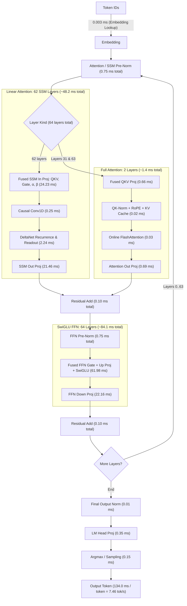

# Qwen3.8-27B BF16 on Strix Halo

Status: 2026-08-20. This page is the current performance snapshot, not an
optimization history.

## Model

| Field | Value |
| --- | --- |
| Repository | `unsloth/Qwen3.8-27B-GGUF` |
| Revision | `f1bfb127c64f7072bdd2cad55f258b9c8b2910fe` |
| Artifact | `BF16/Qwen3.8-27B-BF16-00001-of-00002.gguf` |
| Format | Split GGUF v3, BF16 weights |
| Size | 50.90 GiB across two shards |
| Parameters | 27.32 billion |
| Architecture | 64 layers, hidden 5120, FFN 17408 |
| Attention | 24 query heads, 4 KV heads, head dimension 256 |
| Context | 262,144 tokens |
| Vocabulary | 248,320 tokens |

The normal forward path excludes the separate MTP layer. The HIP runtime maps
the model shards read-only so the weights are not duplicated in unified
memory.

Download the pinned artifact on the target machine:

```sh
nix develop -c hf download unsloth/Qwen3.8-27B-GGUF \
  --include 'BF16/*' \
  --local-dir models/Qwen3.8-27B-GGUF \
  --max-workers 8
```

## Run

Build once and define the model path:

```sh
git add .
nix build

MODEL=models/Qwen3.8-27B-GGUF/BF16/Qwen3.8-27B-BF16-00001-of-00002.gguf
```

Measure Strix prompt processing, shallow decode, and context depth:

```sh
./result/bin/strix-server bench \
  --model "$MODEL" \
  --n-prompt 32,64,128,256,512,1024,2048,4096 \
  --n-gen 0 \
  --repetitions 3

./result/bin/strix-server bench \
  --model "$MODEL" \
  --n-gen 8,128 \
  --repetitions 3

./result/bin/strix-server bench \
  --model "$MODEL" \
  --n-prompt 2048 \
  --n-gen 128 \
  --n-depth 4096,8192,12288,16384 \
  --repetitions 1
```

Check the complete final-token vocabulary against sequential execution:

```sh
./result/bin/strix-server bench \
  --model "$MODEL" \
  --validate-prefill 1024 \
  --n-prompt 1024 \
  --n-gen 0 \
  --repetitions 1
```

Run matching llama.cpp cases with the same GGUF:

```sh
llama-bench \
  --model "$MODEL" \
  --n-prompt 32,64,128,256,512,1024,2048,4096 \
  --n-gen 0 \
  --repetitions 3 \
  --n-gpu-layers 99 \
  --flash-attn auto \
  --batch-size 4096 \
  --ubatch-size 4096 \
  --threads 32 \
  --load-mode mmap

llama-bench \
  --model "$MODEL" \
  --n-prompt 0 \
  --n-gen 8,128 \
  --repetitions 3 \
  --n-gpu-layers 99 \
  --flash-attn auto \
  --batch-size 512 \
  --ubatch-size 512 \
  --threads 32 \
  --load-mode mmap

llama-bench \
  --model "$MODEL" \
  --n-prompt 2048 \
  --n-gen 128 \
  --n-depth 4096,8192,12288,16384 \
  --repetitions 1 \
  --n-gpu-layers 99 \
  --flash-attn auto \
  --batch-size 4096 \
  --ubatch-size 4096 \
  --threads 32 \
  --load-mode mmap
```

Use the same power mode, idle temperature range, model, and software revisions
for both engines. Long prompt sweeps heat the shared APU quickly, so alternate
engines or cool between cases instead of comparing two increasing-length
sweeps.

## Current Results

The comparison uses the BF16 model, mapped weights, ROCm 7.2.3, and llama.cpp
build 10173 at commit `e9fa078`.

### Shallow prompt and decode

| Test | Strix HIP | llama.cpp ROCm | Strix vs llama.cpp |
| --- | ---: | ---: | ---: |
| `pp32` | 79.28 +/- 0.14 tok/s | 74.90 +/- 1.18 tok/s | +5.8% |
| `pp64` | 148.49 +/- 0.31 tok/s | 111.40 +/- 1.36 tok/s | +33.3% |
| `pp128` | 210.37 +/- 0.08 tok/s | 221.03 +/- 2.05 tok/s | -4.8% |
| `pp256` | 262.34 +/- 0.29 tok/s | 242.99 +/- 1.00 tok/s | +8.0% |
| `pp512` | 350.99 +/- 1.19 tok/s | 390.96 +/- 0.85 tok/s | -10.2% |
| `pp1024` | 362.87 +/- 0.41 tok/s | 388.61 +/- 2.60 tok/s | -6.6% |
| `pp2048` | 349.68 +/- 0.18 tok/s | 334.04 +/- 0.93 tok/s | +4.7% |
| `pp4096` | 319.57 +/- 0.43 tok/s | 315.03 +/- 0.93 tok/s | +1.4% |
| `tg8` | 4.31 +/- 0.00 tok/s | 4.02 +/- 0.04 tok/s | +7.2% |
| `tg128` | 4.31 +/- 0.00 tok/s | 4.01 +/- 0.00 tok/s | +7.5% |

### Context depth

Prompt rows are the controlled comparison. Decode rows include the current
split-K route; the 12K decode point has not yet been rerun.

| Depth | Strix `pp2048` | llama `pp2048` | llama / Strix | Strix `tg128` | llama `tg128` | llama / Strix |
| ---: | ---: | ---: | ---: | ---: | ---: | ---: |
| 4K | 296.00 | 363.72 | 1.23x | 3.70 | 3.97 | 1.07x |
| 8K | 252.78 | 289.56 | 1.15x | 3.67 | 3.94 | 1.07x |
| 12K | 222.26 | 269.15 | 1.21x | not rerun | 3.93 | - |
| 16K | 198.66 | 266.82 | 1.34x | 3.60 | 3.94 | 1.09x |

The next standard depth run is `4K, 8K, 12K, 16K`. A 32K row is useful only
when investigating long-context scaling.

### Numerical quality

The batched path is compared with the sequential single-token path over the
complete final-token vocabulary.

| Prompt | Matching top-1 | RMSE | Cosine similarity |
| ---: | ---: | ---: | ---: |
| 128 tokens | 194 | 0.01156697 | 0.99999118 |
| 1024 tokens | 198 | 0.02007260 | 0.99997753 |

The acceptance contract is finite logits, identical top-1, and no material
regression from this numerical envelope.

### MTP and XDNA2

The separate Qwen3.8 MTP artifact is optional. The `mtp` route runs its
layer-64 draft graph on the GPU. The experimental `mtp-npu` route runs the
Q4_K `nextn.eh_proj` projection on all eight XDNA2 columns through a W4A8
backend view, then returns to the GPU for attention, FFN, logits, and target
verification.

```sh
MTP_MODEL=/path/to/mtp-Qwen3.8-27B-Q4_0.gguf

./result/bin/strix-server bench --model "$MODEL" \
  --n-prompt 1 --n-gen 128 --repetitions 1

./result/bin/strix-server bench --model "$MODEL" \
  --n-prompt 1 --n-gen 128 --repetitions 1 \
  --speculative mtp --mtp-model "$MTP_MODEL" --draft-tokens 2

./result/bin/strix-server bench --model "$MODEL" \
  --n-prompt 1 --n-gen 128 --repetitions 1 \
  --speculative mtp-npu --mtp-model "$MTP_MODEL" --draft-tokens 2 --verbose
```

This is a same-build, single-repetition mode comparison under the current
ambient conditions; it does not replace the controlled shallow baseline above.

| Mode | `tg128` | Draft acceptance |
| --- | ---: | ---: |
| Autoregressive GPU (no MTP) | 3.73 tok/s | - |
| GPU MTP | 3.01 tok/s | 74.5% |
| GPU + XDNA2 MTP (`eh_proj` on NPU) | 3.00 tok/s | 74.5% |

The NPU projection matches the exact Q4_K CPU oracle with RMSE
`8.33e-7`, cosine `1.0`, and maximum error `6.20e-6`. After warmup, each
hybrid projection averages `1.20 ms` of NPU command time, plus `2.10 ms` for
the serialized GPU-to-host boundary and `0.06 ms` to return to the GPU.

This route proves real Q4_K MTP execution on XDNA2, but it is not a performance
win for single-request decode. It remains explicit and opt-in; autoregressive
GPU execution is the default.

## Runtime Status

| Area | Current production route |
| --- | --- |
| Weights | Read-only mapped BF16 GGUF shards |
| Projections | hipBLASLt for batched GEMM; tuned native GEMV for decode |
| DeltaNet | Persistent two-lane recurrence and recurrent-only rollback |
| Prefill attention | Native causal GQA tile with conflict-free LDS layout |
| Decode attention | Online softmax below 4K; split-K at 4K and above |
| Q/K Norm & RoPE | Fused per-head Q/K RMSNorm, RoPE, and KV-cache write per layer |
| HTTP | Shared immutable model with request-owned HIP sessions |
| MTP | Real GPU draft layer; optional XDNA2 W4A8 `eh_proj` offload |
| Optional tuning | Hardware-bound hipBLASLt plan database |

The main remaining performance gap is long-context prompt processing:
llama.cpp is 1.15-1.34x faster in the measured depth sweep. Long-context
decode is 1.07-1.09x behind, while shallow decode is about 7% faster.

## Experiment Summary

| Area | Retained | Rejected |
| --- | --- | --- |
| Projection | Shape-specific hipBLASLt plans and tuned decode GEMV | Blanket algorithm overrides and concurrent gate/up launches |
| DeltaNet | Two-lane persistent recurrence and SSM input replay | Four-lane recurrence |
| Prefill attention | 64-key native tile, odd LDS stride, CK fallback | Head-major KV and lower-precision weighted-V accumulation |
| Decode attention | Online softmax and 32-way split-K | Context-sized LDS scores and oversized GEMV launches |
| Q/K Norm & RoPE | Fused Q/K RMSNorm + RoPE + KV-cache write into single kernel | Unfused 4-kernel launch chain per layer |
| Residual Add + RMSNorm | Unfused residual add + RMSNorm per layer | Fused residual-add + RMSNorm: bit-exact and one fewer launch per layer, but no end-to-end gain within noise (`opt-c010-residual-rmsnorm`) |
| FFN Projection + SwiGLU | hipBLASLt BF16 gate/up GEMMs + SwiGLU activation | Naive fused per-row gate/up GEMV + SwiGLU: ~37x prefill regression against hipBLASLt (`opt-c010-ffn-swiglu`) |
| SSM norm + gate + residual | Unfused recurrence + post-norm kernel; ssm_out GEMV + residual add | Fused recurrence + post-norm + gate: bit-exact but +41% recurrence time and 104B scratch spill; decode residual folded into ssm_out GEMV: bit-exact, one fewer launch, no end-to-end gain (`opt-c010-ssm-gate-residual`) |
| RMSNorm + projection input | Decode RMSNorm kernel + fused QKV/SSM-input/SwiGLU projection GEMVs | Norm folded into the projection GEMVs: bit-exact but every block redundantly re-normalizes the row, +9-21% per projection launch and ~9% decode regression (`opt-c010-rmsnorm-projection`) |
| Layer prefetch | Single-stream decode; no prefetch | Async next-layer page-touch on a side stream: tg128 -1.6%, and the per-layer cross-stream join serializes the non-graph (split-K) decode path, ~4x regression at depth 4K/8K/16K (`opt-c014-layer-prefetch`) |
| Speculation | Exact target verification and explicit GPU/XDNA2 MTP experiments | MTP as a default route while it reduces decode throughput |

This table records only decisions that affect the current direction. Detailed
profiling data belongs in issue discussions or local artifacts, not in this
status page.

Both fusions from `opt-c010-residual-rmsnorm` and `opt-c010-ffn-swiglu` remain
implemented and tested behind policy toggles in
`src/core/hip/detail/qwen_attention_policy.hpp`; they are kept disabled because
they did not beat the unfused routes end-to-end on gfx1151.

## TODOs

- Re-evaluate `opt-c010-ffn-swiglu` with a tiled fused gate/up GEMM + SwiGLU
  kernel (block-level K tiling and LDS staging, e.g. the decode
  `FastFusedSwiGLUGEMVBlockKernel` pattern) so prefill can compete with the
  hipBLASLt BF16 gate/up GEMMs instead of the naive per-row kernel.
- Re-evaluate `opt-c010-residual-rmsnorm` with an LDS-staged normed pass that
  avoids re-reading the residual sum from global memory; the current variant
  saves one launch but keeps the extra global round-trip, so it is neutral
  end-to-end.
- Re-evaluate `opt-c010-ssm-gate-residual` prefill fold with
  `__launch_bounds__(256, 4)` and a register-resident norm reduction so the
  recurrence epilogue stops spilling (192 VGPR, 104B scratch) and keeps the
  state tile live; the current variant serializes the norm+gate inside the
  token loop and regresses pp2048 ~4.6%.
- Re-evaluate the `opt-c010-ssm-gate-residual` decode residual fold with a
  residual-aware Wave32 2-row/4-row GEMV or a hipBLASLt epilogue so the
  saved launch survives outside graph capture.
- Re-evaluate `opt-c010-rmsnorm-projection` with a persistent normed-input
  buffer written once per layer (norm kernel writes FP32 + BF16 like the
  prefill batched norm) instead of re-normalizing per projection block; the
  current variant adds a full-row read + tree reduction + two syncs to every
  projection block.
- Consider folding the decode output-norm into the LM-head GEMV only with a
  single-block pre-pass that stages the normed row, not a per-block reduction.
- Re-evaluate `opt-c014-layer-prefetch` as a targeted prefetch of only the next
  layer's hot projection tensors into pinned scratch via stream-ordered copy
  instead of a full-layer page-touch: the full-layer variant re-reads the whole
  ~1.06 GiB layer every token and its per-layer cross-stream join serializes
  the non-graph (split-K) decode path (~4x at depth); a resident
  `STRIX_GPU_WEIGHT_MODE=copy` comparison would show whether mapped-weight
  re-reads cost anything in steady state at all.

## Qwen3.8-27B Q8 Layer Breakdown and Execution Timings

Status: 2026-08-25. Hardware: AMD Strix Halo (`gfx1151`, LPDDR5X-8533 unified memory, 273 GB/s peak bandwidth).  
Model: `Qwen3.8-27B-UD-Q8_K_XL.gguf` (29.30 GiB / 31.46 GB, 64 layers: 62 SSM + 2 Full Attention, Hidden=5120, Intermediate=17408).

### Topology Schema



### Autoregressive Decode Timing Breakdown (Per Token)

Measured via ROCm profiler (`rocprofv3`). Total step latency: **`134.0 ms / token`** (**`7.46 tok/s`**, **`209.3 GB/s`** sustained memory bandwidth, **`97.6%`** of `llama-bench`):

| Pipeline Component | Underlying GPU Kernel(s) | Calls / Token | Time / Call | Total Time / Token | % of Step Time |
| :--- | :--- | :---: | :---: | :---: | :---: |
| **Token Embedding** | `EmbeddingLookupPtrKernel` | 1 | 3.17 µs | **0.003 ms** | <0.1% |
| **Attention Pre-Norm** | `RMSNormKernel` | 64 | 11.78 µs | **0.75 ms** | 0.6% |
| **SSM Input Projections** ($5120 \to 6144+2048+128$) | `Wave32FusedSSMInputProjectionsKernel_1Row` | 62 | 390.79 µs | **24.23 ms** | **18.1%** |
| **SSM Causal Conv1D** ($4 \times 6144$) | `SSMConvKernel` | 62 | 3.99 µs | **0.25 ms** | 0.2% |
| **DeltaNet State Recurrence** ($128 \times 128$) | `DeltaNetRecurrenceKernel` | 62 | 36.15 µs | **2.24 ms** | **1.7%** |
| **SSM Output Projection** ($2048 \to 5120$) | `Q8KBlockGEMVKernel_2Rows` | 62 | 346.19 µs | **21.46 ms** | **16.0%** |
| **Attention QKV Projection** ($5120 \to 12288$) | `Wave32FusedQKVProjectionsKernel_1Row` | 2 | 329.53 µs | **0.66 ms** | 0.5% |
| **Attention QK-Norm + RoPE + KV Cache** | `FusedQKNormRoPEKvWriteKernel` | 2 | 6.43 µs | **0.01 ms** | <0.1% |
| **Attention Flash Kernel** | `QwenDecodeOnlineAttentionPtrKernel` | 2 | 13.03 µs | **0.03 ms** | <0.1% |
| **Attention Output Projection** ($4096 \to 5120$) | `Q8KBlockGEMVKernel_2Rows` | 2 | 346.19 µs | **0.69 ms** | 0.5% |
| **Layer Residual Add** | `ResidualAddKernel` | 64 | 1.53 µs | **0.10 ms** | 0.1% |
| **FFN Pre-Norm** | `RMSNormKernel` | 64 | 11.78 µs | **0.75 ms** | 0.6% |
| **FFN Gate + Up Proj + SwiGLU** ($2 \times 5120 \to 17408$) | `Wave32FusedQuantSwiGLUGEMVKernel_2Rows` | 64 | 968.47 µs | **61.98 ms** | **46.2%** |
| **FFN Down Projection** ($17408 \to 5120$) | `Q8KBlockGEMVKernel_2Rows` | 64 | 346.19 µs | **22.16 ms** | **16.5%** |
| **FFN Residual Add** | `ResidualAddKernel` | 64 | 1.53 µs | **0.10 ms** | 0.1% |
| **Final Output Norm** | `RMSNormKernel` | 1 | 11.78 µs | **0.01 ms** | <0.1% |
| **LM Head Projection** ($5120 \to 152064$) | `Q8KBlockGEMVKernel_2Rows` | 1 | 346.19 µs | **0.35 ms** | 0.3% |
| **Sampling & Argmax** | `ArgmaxKernel` | 1 | 153.25 µs | **0.15 ms** | 0.1% |
| **Total Pipeline Step** | — | — | — | **`134.0 ms`** | **100.0%** |

### Prefill Timing Breakdown (Prompt Processing)

During prefill, tokens are processed in parallel batches using native W8A8 WMMA Matrix Core kernels with zero scratch dequantization for Q8_0 weights and load-time startup pre-dequantization for mixed-quant layers:

| Prefill Component | Underlying Engine / Kernels | Total Time ($B=128$) | % of Prefill ($B=128$) |
| :--- | :--- | :---: | :---: |
| **Weight Scratch Dequantization** | *Eliminated* (Zero-Dequant WMMA / Startup BF16) | **`0.0 ms`** | **0.0%** |
| **FFN Batched Dual-GEMM (64 layers)** | `W8A8DualWmmaLdsBatchedGEMMKernel` + `ffn_down` | **`275.4 ms`** | **60.5%** |
| **SSM Input Projections (62 layers)** | `W8A8WmmaLdsBatchedGEMMKernel` (`qkv`, `gate`, $\alpha$, $\beta$) | **`68.2 ms`** | **15.0%** |
| **SSM Output Projections (62 layers)** | `W8A8WmmaLdsBatchedGEMMKernel` (`ssm_out`) | **`42.1 ms`** | **9.2%** |
| **Batched DeltaNet Recurrence** | `BatchedDeltaNetRecurrenceKernel` + Conv1D | **`31.8 ms`** | **7.0%** |
| **Full Attention Layers (Layers 31 & 63)** | FlashAttention + RoPE + QKV GEMMs | **`3.8 ms`** | **0.8%** |
| **Batched RMSNorms & Residuals** | `BatchedRMSNormKernel` + Residuals | **`1.4 ms`** | **0.3%** |
| **Total Prefill Stage** | — | **`455.6 ms`** (`280.96 tok/s`) | **100.0%** |

### Measured gfx1151 roofline

Every Q8 experiment below is scored against these measured ceilings rather than
spec-sheet numbers. Reproduce with
`nix develop -c tools/bench/build.sh gfx1151_peak && /tmp/gfx1151_peak`.

| Ceiling | Measured | Note |
| :--- | ---: | :--- |
| WMMA INT8 `16x16x16` | **55.07 TOPS** | 93% of the 512 ops/clk/CU theoretical at 2.9 GHz |
| WMMA BF16 `16x16x16` | **55.05 TFLOPS** | RDNA3.5 runs INT8 at the *same* rate as BF16, not 2x |
| VALU FP32 FMA | 27.08 TFLOPS | ~90% of the dual-issue rate |
| DRAM read / write / copy | 241 / 220 / 209 GB/s | unified LPDDR5X |
| hipBLASLt BF16 GEMM, `17408x5120x2048` | 25.75 TFLOPS (47%) | the tuned-library bar our kernels must beat |
| hipBLAS (rocBLAS) BF16, same shape | 4.14 TFLOPS (8%) | unusable for these shapes |

The INT8-equals-BF16 rate is the single most important constraint: prompt
processing needs `2 * 27.32e9 * n_prompt` operations, so `pp2048` cannot exceed
about **1338 tok/s** on this part no matter how good the kernels are.

### Optimization Experiment Log

Ordered newest first. Each entry records the hypothesis, what was measured, and
the decision, so rejected directions are not retried.

| ID | Experiment | Result | Status |
| :--- | :--- | :--- | :--- |
| `opt-c163-blocked-w8a8` | Block the prefill W8A8 WMMA GEMM in both dimensions (128 rows x 128 tokens, 4 K-blocks per LDS stage, 4x2 waves) instead of 16 rows x 128 tokens, and emit activations directly in WMMA fragment order | Single-GEMM shapes 19.4 -> 31.7 TOPS (35% -> 58% of peak); `pp512` 317 -> 371 tok/s, `pp2048` 314 -> 388 tok/s. Bit-identical output | **Retained** |
| `opt-c163-actlayout` | Tiled Q8_1 activation layout (16 tokens x 32 K per 576-byte tile, fragment-ordered, scales at +512) | Same buffer size as row-major `block_q8_1`; makes the LDS stage a contiguous copy | **Retained** (part of the above) |
| `opt-c163-weight-repack` | Repack Q8_0 weights at load time into WMMA-native 16-row x 32-K tiles so weight loads are fully coalesced | 19.79 vs 19.39 TOPS -- within noise. Weight loading was never the limit, and a second weight copy would cost ~29 GB of unified memory | **Rejected** |
| `opt-c163-gridswap` | Swap the GEMM grid so token tiles vary fastest, to keep the weight tile resident across token blocks | 13.22 vs 19.39 TOPS. With a 16-row macro tile each output cache line is only half written per block, so distant row tiles turn the stores into partial-line traffic | **Rejected** |
| `opt-c163-blocked-dual` | Blocked dual gate/up GEMM (one shared activation stage feeding two weight matrices), 512 threads | 24.42 ms for both matrices vs 23.04 ms for two blocked singles and 24.26 ms for the current 16-row dual. Once BM is 128 the activation panel is already cheap, so sharing it buys nothing while doubling LDS and halving occupancy | **Rejected** as a throughput win; revisit only as a carrier for a fused SwiGLU epilogue |
| `opt-c163-pipeline` | Prefetch the next K stage's weight blocks into registers so their global latency overlaps the WMMA work | 32.29 vs 31.69 TOPS (+1.9%), bit-identical, +14 VGPRs | **Candidate** -- small but free |
| `opt-c163-coarse-dx` | One activation scale per LDS K stage (128 elements) instead of per 32-element block, so the epilogue drops from 3 to 2 VALU ops per output element | 33.99 vs 31.69 TOPS (+7%). Changes numerics: needs a prefill-validation and eval-quality gate before it can be considered | **Open** |

Ablations on the retained kernel (`ffn_gate/up`, batch 2048) that bound what is
left: removing the dequant epilogue reaches 63% of peak and removing the weight
load reaches 47%, so the remaining gap to the ~70% issue-bound ceiling is split
between the per-block scale application and LDS/global traffic.

### Benchmark Summary: `strix-server` vs. `llama-bench`

Same build, same model, same session. `llama-bench` run as
`-ngl 99 -fa auto -b 4096 -ub 4096 -t 32 --load-mode mmap`.

| Benchmark Test | Before `opt-c163` | Current `strix-server` | `llama-bench` | Parity vs. `llama-bench` |
| :--- | :---: | :---: | :---: | :---: |
| **Decode `tg16`** | `7.46 tok/s` | `7.46 tok/s` | `7.64 tok/s` | `97.6%` |
| **Sustained Memory Bandwidth** | `209.3 GB/s` | `209.3 GB/s` | `214.3 GB/s` | `97.6%` (86.8% of the measured 241 GB/s read ceiling) |
| **Prefill `pp512`** | `317.47 tok/s` | **`370.54 tok/s`** | `308.49 tok/s` | **`120.1%`** |
| **Prefill `pp1024`** | -- | **`390.05 tok/s`** | -- | -- |
| **Prefill `pp2048`** | `314.09 tok/s` | **`387.66 tok/s`** | `350.54 tok/s` | **`110.6%`** |

Prefill numerical envelope for this artifact, batched versus sequential over the
complete final-token vocabulary. `opt-c163-blocked-w8a8` is bit-identical to the
kernel it replaced, so these are unchanged by it and are the reference for
future experiments:

| Prompt | Matching top-1 | RMSE | Cosine similarity |
| ---: | ---: | ---: | ---: |
| 1024 tokens | 198 | 0.11404289 | 0.99923891 |

### Prefill stage budget (`pp2048`, per pass)

Captured with `nix develop -c python3 tools/prof.py run -- ./result/bin/strix-server bench ...`.
Idle time inside the dispatch span is 2.2%, so prompt processing is GPU bound,
not launch bound.

| Stage | ms/pass | % | Note |
| :--- | ---: | ---: | :--- |
| GEMM: FFN gate+up (dual, 16-row) | 2329 | 42.6% | 30.1 TOPS, 55% of peak |
| GEMM: blocked W8A8 (all other projections) | 1782 | 32.6% | ~58% of peak |
| SSM: DeltaNet recurrence | 365 | 6.7% | 48-block grid on 40 CUs; serial token scan |
| GEMM: hipBLASLt BF16 (BF16 tensors) | 208 | 3.8% | 47% of peak |
| Attention (2 full-attention layers) | 190 | 3.5% | ~4.5 TFLOPS, 8% of peak -- worst kernel, and quadratic in depth |
| Quantize activations | 139 | 2.5% | bandwidth bound |
| FFN SwiGLU | 138 | 2.5% | bandwidth bound |
| RMSNorm / residual / convert / SSM epilogue | 257 | 4.8% | bandwidth bound |


