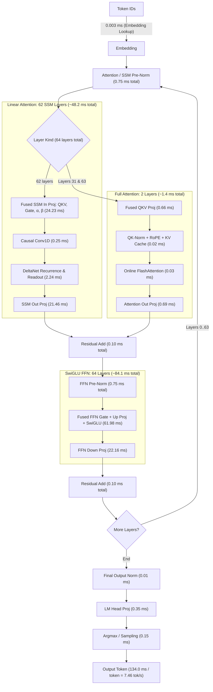

# Qwen3.8-27B BF16 on Strix Halo

Status: 2026-08-20. This page is the current performance snapshot, not an
optimization history.

## Model

| Field | Value |
| --- | --- |
| Repository | `unsloth/Qwen3.8-27B-GGUF` |
| Revision | `f1bfb127c64f7072bdd2cad55f258b9c8b2910fe` |
| Artifact | `BF16/Qwen3.8-27B-BF16-00001-of-00002.gguf` |
| Format | Split GGUF v3, BF16 weights |
| Size | 50.90 GiB across two shards |
| Parameters | 27.32 billion |
| Architecture | 64 layers, hidden 5120, FFN 17408 |
| Attention | 24 query heads, 4 KV heads, head dimension 256 |
| Context | 262,144 tokens |
| Vocabulary | 248,320 tokens |

The normal forward path excludes the separate MTP layer. The HIP runtime maps
the model shards read-only so the weights are not duplicated in unified
memory.

Download the pinned artifact on the target machine:

```sh
nix develop -c hf download unsloth/Qwen3.8-27B-GGUF \
  --include 'BF16/*' \
  --local-dir models/Qwen3.8-27B-GGUF \
  --max-workers 8
```

## Run

Build once and define the model path:

```sh
git add .
nix build

MODEL=models/Qwen3.8-27B-GGUF/BF16/Qwen3.8-27B-BF16-00001-of-00002.gguf
```

Measure Strix prompt processing, shallow decode, and context depth:

```sh
./result/bin/strix-server bench \
  --model "$MODEL" \
  --n-prompt 32,64,128,256,512,1024,2048,4096 \
  --n-gen 0 \
  --repetitions 3

./result/bin/strix-server bench \
  --model "$MODEL" \
  --n-gen 8,128 \
  --repetitions 3

./result/bin/strix-server bench \
  --model "$MODEL" \
  --n-prompt 2048 \
  --n-gen 128 \
  --n-depth 4096,8192,12288,16384 \
  --repetitions 1
```

Check the complete final-token vocabulary against sequential execution:

```sh
./result/bin/strix-server bench \
  --model "$MODEL" \
  --validate-prefill 1024 \
  --n-prompt 1024 \
  --n-gen 0 \
  --repetitions 1
```

Run matching llama.cpp cases with the same GGUF:

```sh
llama-bench \
  --model "$MODEL" \
  --n-prompt 32,64,128,256,512,1024,2048,4096 \
  --n-gen 0 \
  --repetitions 3 \
  --n-gpu-layers 99 \
  --flash-attn auto \
  --batch-size 4096 \
  --ubatch-size 4096 \
  --threads 32 \
  --load-mode mmap

llama-bench \
  --model "$MODEL" \
  --n-prompt 0 \
  --n-gen 8,128 \
  --repetitions 3 \
  --n-gpu-layers 99 \
  --flash-attn auto \
  --batch-size 512 \
  --ubatch-size 512 \
  --threads 32 \
  --load-mode mmap

llama-bench \
  --model "$MODEL" \
  --n-prompt 2048 \
  --n-gen 128 \
  --n-depth 4096,8192,12288,16384 \
  --repetitions 1 \
  --n-gpu-layers 99 \
  --flash-attn auto \
  --batch-size 4096 \
  --ubatch-size 4096 \
  --threads 32 \
  --load-mode mmap
```

Use the same power mode, idle temperature range, model, and software revisions
for both engines. Long prompt sweeps heat the shared APU quickly, so alternate
engines or cool between cases instead of comparing two increasing-length
sweeps.

## Current Results

The comparison uses the BF16 model, mapped weights, ROCm 7.2.3, and llama.cpp
build 10173 at commit `e9fa078`.

### Shallow prompt and decode

| Test | Strix HIP | llama.cpp ROCm | Strix vs llama.cpp |
| --- | ---: | ---: | ---: |
| `pp32` | 79.28 +/- 0.14 tok/s | 74.90 +/- 1.18 tok/s | +5.8% |
| `pp64` | 148.49 +/- 0.31 tok/s | 111.40 +/- 1.36 tok/s | +33.3% |
| `pp128` | 210.37 +/- 0.08 tok/s | 221.03 +/- 2.05 tok/s | -4.8% |
| `pp256` | 262.34 +/- 0.29 tok/s | 242.99 +/- 1.00 tok/s | +8.0% |
| `pp512` | 350.99 +/- 1.19 tok/s | 390.96 +/- 0.85 tok/s | -10.2% |
| `pp1024` | 362.87 +/- 0.41 tok/s | 388.61 +/- 2.60 tok/s | -6.6% |
| `pp2048` | 349.68 +/- 0.18 tok/s | 334.04 +/- 0.93 tok/s | +4.7% |
| `pp4096` | 319.57 +/- 0.43 tok/s | 315.03 +/- 0.93 tok/s | +1.4% |
| `tg8` | 4.31 +/- 0.00 tok/s | 4.02 +/- 0.04 tok/s | +7.2% |
| `tg128` | 4.31 +/- 0.00 tok/s | 4.01 +/- 0.00 tok/s | +7.5% |

### Context depth

Prompt rows are the controlled comparison. Decode rows include the current
split-K route; the 12K decode point has not yet been rerun.

| Depth | Strix `pp2048` | llama `pp2048` | llama / Strix | Strix `tg128` | llama `tg128` | llama / Strix |
| ---: | ---: | ---: | ---: | ---: | ---: | ---: |
| 4K | 296.00 | 363.72 | 1.23x | 3.70 | 3.97 | 1.07x |
| 8K | 252.78 | 289.56 | 1.15x | 3.67 | 3.94 | 1.07x |
| 12K | 222.26 | 269.15 | 1.21x | not rerun | 3.93 | - |
| 16K | 198.66 | 266.82 | 1.34x | 3.60 | 3.94 | 1.09x |

The next standard depth run is `4K, 8K, 12K, 16K`. A 32K row is useful only
when investigating long-context scaling.

### Numerical quality

The batched path is compared with the sequential single-token path over the
complete final-token vocabulary.

| Prompt | Matching top-1 | RMSE | Cosine similarity |
| ---: | ---: | ---: | ---: |
| 128 tokens | 194 | 0.01156697 | 0.99999118 |
| 1024 tokens | 198 | 0.02007260 | 0.99997753 |

The acceptance contract is finite logits, identical top-1, and no material
regression from this numerical envelope.

### MTP and XDNA2

The separate Qwen3.8 MTP artifact is optional. The `mtp` route runs its
layer-64 draft graph on the GPU. The experimental `mtp-npu` route runs the
Q4_K `nextn.eh_proj` projection on all eight XDNA2 columns through a W4A8
backend view, then returns to the GPU for attention, FFN, logits, and target
verification.

```sh
MTP_MODEL=/path/to/mtp-Qwen3.8-27B-Q4_0.gguf

./result/bin/strix-server bench --model "$MODEL" \
  --n-prompt 1 --n-gen 128 --repetitions 1

./result/bin/strix-server bench --model "$MODEL" \
  --n-prompt 1 --n-gen 128 --repetitions 1 \
  --speculative mtp --mtp-model "$MTP_MODEL" --draft-tokens 2

./result/bin/strix-server bench --model "$MODEL" \
  --n-prompt 1 --n-gen 128 --repetitions 1 \
  --speculative mtp-npu --mtp-model "$MTP_MODEL" --draft-tokens 2 --verbose
```

This is a same-build, single-repetition mode comparison under the current
ambient conditions; it does not replace the controlled shallow baseline above.

| Mode | `tg128` | Draft acceptance |
| --- | ---: | ---: |
| Autoregressive GPU (no MTP) | 3.73 tok/s | - |
| GPU MTP | 3.01 tok/s | 74.5% |
| GPU + XDNA2 MTP (`eh_proj` on NPU) | 3.00 tok/s | 74.5% |

The NPU projection matches the exact Q4_K CPU oracle with RMSE
`8.33e-7`, cosine `1.0`, and maximum error `6.20e-6`. After warmup, each
hybrid projection averages `1.20 ms` of NPU command time, plus `2.10 ms` for
the serialized GPU-to-host boundary and `0.06 ms` to return to the GPU.

This route proves real Q4_K MTP execution on XDNA2, but it is not a performance
win for single-request decode. It remains explicit and opt-in; autoregressive
GPU execution is the default.

## Runtime Status

| Area | Current production route |
| --- | --- |
| Weights | Read-only mapped BF16 GGUF shards |
| Projections | hipBLASLt for batched GEMM; tuned native GEMV for decode |
| DeltaNet | Persistent two-lane recurrence and recurrent-only rollback |
| Prefill attention | Native causal GQA tile with conflict-free LDS layout |
| Decode attention | Online softmax below 4K; split-K at 4K and above |
| Q/K Norm & RoPE | Fused per-head Q/K RMSNorm, RoPE, and KV-cache write per layer |
| HTTP | Shared immutable model with request-owned HIP sessions |
| MTP | Real GPU draft layer; optional XDNA2 W4A8 `eh_proj` offload |
| Optional tuning | Hardware-bound hipBLASLt plan database |

The main remaining performance gap is long-context prompt processing:
llama.cpp is 1.15-1.34x faster in the measured depth sweep. Long-context
decode is 1.07-1.09x behind, while shallow decode is about 7% faster.

## Experiment Summary

| Area | Retained | Rejected |
| --- | --- | --- |
| Projection | Shape-specific hipBLASLt plans and tuned decode GEMV | Blanket algorithm overrides and concurrent gate/up launches |
| DeltaNet | Two-lane persistent recurrence and SSM input replay | Four-lane recurrence |
| Prefill attention | 64-key native tile, odd LDS stride, CK fallback | Head-major KV and lower-precision weighted-V accumulation |
| Decode attention | Online softmax and 32-way split-K | Context-sized LDS scores and oversized GEMV launches |
| Q/K Norm & RoPE | Fused Q/K RMSNorm + RoPE + KV-cache write into single kernel | Unfused 4-kernel launch chain per layer |
| Residual Add + RMSNorm | Unfused residual add + RMSNorm per layer | Fused residual-add + RMSNorm: bit-exact and one fewer launch per layer, but no end-to-end gain within noise (`opt-c010-residual-rmsnorm`) |
| FFN Projection + SwiGLU | hipBLASLt BF16 gate/up GEMMs + SwiGLU activation | Naive fused per-row gate/up GEMV + SwiGLU: ~37x prefill regression against hipBLASLt (`opt-c010-ffn-swiglu`) |
| SSM norm + gate + residual | Unfused recurrence + post-norm kernel; ssm_out GEMV + residual add | Fused recurrence + post-norm + gate: bit-exact but +41% recurrence time and 104B scratch spill; decode residual folded into ssm_out GEMV: bit-exact, one fewer launch, no end-to-end gain (`opt-c010-ssm-gate-residual`) |
| RMSNorm + projection input | Decode RMSNorm kernel + fused QKV/SSM-input/SwiGLU projection GEMVs | Norm folded into the projection GEMVs: bit-exact but every block redundantly re-normalizes the row, +9-21% per projection launch and ~9% decode regression (`opt-c010-rmsnorm-projection`) |
| Layer prefetch | Single-stream decode; no prefetch | Async next-layer page-touch on a side stream: tg128 -1.6%, and the per-layer cross-stream join serializes the non-graph (split-K) decode path, ~4x regression at depth 4K/8K/16K (`opt-c014-layer-prefetch`) |
| Speculation | Exact target verification and explicit GPU/XDNA2 MTP experiments | MTP as a default route while it reduces decode throughput |

This table records only decisions that affect the current direction. Detailed
profiling data belongs in issue discussions or local artifacts, not in this
status page.

Both fusions from `opt-c010-residual-rmsnorm` and `opt-c010-ffn-swiglu` remain
implemented and tested behind policy toggles in
`src/core/hip/detail/qwen_attention_policy.hpp`; they are kept disabled because
they did not beat the unfused routes end-to-end on gfx1151.

## TODOs

- Re-evaluate `opt-c010-ffn-swiglu` with a tiled fused gate/up GEMM + SwiGLU
  kernel (block-level K tiling and LDS staging, e.g. the decode
  `FastFusedSwiGLUGEMVBlockKernel` pattern) so prefill can compete with the
  hipBLASLt BF16 gate/up GEMMs instead of the naive per-row kernel.
- Re-evaluate `opt-c010-residual-rmsnorm` with an LDS-staged normed pass that
  avoids re-reading the residual sum from global memory; the current variant
  saves one launch but keeps the extra global round-trip, so it is neutral
  end-to-end.
- Re-evaluate `opt-c010-ssm-gate-residual` prefill fold with
  `__launch_bounds__(256, 4)` and a register-resident norm reduction so the
  recurrence epilogue stops spilling (192 VGPR, 104B scratch) and keeps the
  state tile live; the current variant serializes the norm+gate inside the
  token loop and regresses pp2048 ~4.6%.
- Re-evaluate the `opt-c010-ssm-gate-residual` decode residual fold with a
  residual-aware Wave32 2-row/4-row GEMV or a hipBLASLt epilogue so the
  saved launch survives outside graph capture.
- Re-evaluate `opt-c010-rmsnorm-projection` with a persistent normed-input
  buffer written once per layer (norm kernel writes FP32 + BF16 like the
  prefill batched norm) instead of re-normalizing per projection block; the
  current variant adds a full-row read + tree reduction + two syncs to every
  projection block.
- Consider folding the decode output-norm into the LM-head GEMV only with a
  single-block pre-pass that stages the normed row, not a per-block reduction.
- Re-evaluate `opt-c014-layer-prefetch` as a targeted prefetch of only the next
  layer's hot projection tensors into pinned scratch via stream-ordered copy
  instead of a full-layer page-touch: the full-layer variant re-reads the whole
  ~1.06 GiB layer every token and its per-layer cross-stream join serializes
  the non-graph (split-K) decode path (~4x at depth); a resident
  `STRIX_GPU_WEIGHT_MODE=copy` comparison would show whether mapped-weight
  re-reads cost anything in steady state at all.

## Qwen3.8-27B Q8 Layer Breakdown and Execution Timings

Status: 2026-08-25. Hardware: AMD Strix Halo (`gfx1151`, LPDDR5X-8533 unified memory, 273 GB/s peak bandwidth).  
Model: `Qwen3.8-27B-UD-Q8_K_XL.gguf` (29.30 GiB / 31.46 GB, 64 layers: 62 SSM + 2 Full Attention, Hidden=5120, Intermediate=17408).

### Topology Schema



### Autoregressive Decode Timing Breakdown (Per Token)

Measured via ROCm profiler (`rocprofv3`). Total step latency: **`134.0 ms / token`** (**`7.46 tok/s`**, **`209.3 GB/s`** sustained memory bandwidth, **`97.6%`** of `llama-bench`):

| Pipeline Component | Underlying GPU Kernel(s) | Calls / Token | Time / Call | Total Time / Token | % of Step Time |
| :--- | :--- | :---: | :---: | :---: | :---: |
| **Token Embedding** | `EmbeddingLookupPtrKernel` | 1 | 3.17 µs | **0.003 ms** | <0.1% |
| **Attention Pre-Norm** | `RMSNormKernel` | 64 | 11.78 µs | **0.75 ms** | 0.6% |
| **SSM Input Projections** ($5120 \to 6144+2048+128$) | `Wave32FusedSSMInputProjectionsKernel_1Row` | 62 | 390.79 µs | **24.23 ms** | **18.1%** |
| **SSM Causal Conv1D** ($4 \times 6144$) | `SSMConvKernel` | 62 | 3.99 µs | **0.25 ms** | 0.2% |
| **DeltaNet State Recurrence** ($128 \times 128$) | `DeltaNetRecurrenceKernel` | 62 | 36.15 µs | **2.24 ms** | **1.7%** |
| **SSM Output Projection** ($2048 \to 5120$) | `Q8KBlockGEMVKernel_2Rows` | 62 | 346.19 µs | **21.46 ms** | **16.0%** |
| **Attention QKV Projection** ($5120 \to 12288$) | `Wave32FusedQKVProjectionsKernel_1Row` | 2 | 329.53 µs | **0.66 ms** | 0.5% |
| **Attention QK-Norm + RoPE + KV Cache** | `FusedQKNormRoPEKvWriteKernel` | 2 | 6.43 µs | **0.01 ms** | <0.1% |
| **Attention Flash Kernel** | `QwenDecodeOnlineAttentionPtrKernel` | 2 | 13.03 µs | **0.03 ms** | <0.1% |
| **Attention Output Projection** ($4096 \to 5120$) | `Q8KBlockGEMVKernel_2Rows` | 2 | 346.19 µs | **0.69 ms** | 0.5% |
| **Layer Residual Add** | `ResidualAddKernel` | 64 | 1.53 µs | **0.10 ms** | 0.1% |
| **FFN Pre-Norm** | `RMSNormKernel` | 64 | 11.78 µs | **0.75 ms** | 0.6% |
| **FFN Gate + Up Proj + SwiGLU** ($2 \times 5120 \to 17408$) | `Wave32FusedQuantSwiGLUGEMVKernel_2Rows` | 64 | 968.47 µs | **61.98 ms** | **46.2%** |
| **FFN Down Projection** ($17408 \to 5120$) | `Q8KBlockGEMVKernel_2Rows` | 64 | 346.19 µs | **22.16 ms** | **16.5%** |
| **FFN Residual Add** | `ResidualAddKernel` | 64 | 1.53 µs | **0.10 ms** | 0.1% |
| **Final Output Norm** | `RMSNormKernel` | 1 | 11.78 µs | **0.01 ms** | <0.1% |
| **LM Head Projection** ($5120 \to 152064$) | `Q8KBlockGEMVKernel_2Rows` | 1 | 346.19 µs | **0.35 ms** | 0.3% |
| **Sampling & Argmax** | `ArgmaxKernel` | 1 | 153.25 µs | **0.15 ms** | 0.1% |
| **Total Pipeline Step** | — | — | — | **`134.0 ms`** | **100.0%** |

### Prefill Timing Breakdown (Prompt Processing)

During prefill, tokens are processed in parallel batches using native W8A8 WMMA Matrix Core kernels with zero scratch dequantization for Q8_0 weights and load-time startup pre-dequantization for mixed-quant layers:

| Prefill Component | Underlying Engine / Kernels | Total Time ($B=128$) | % of Prefill ($B=128$) |
| :--- | :--- | :---: | :---: |
| **Weight Scratch Dequantization** | *Eliminated* (Zero-Dequant WMMA / Startup BF16) | **`0.0 ms`** | **0.0%** |
| **FFN Batched Dual-GEMM (64 layers)** | `W8A8DualWmmaLdsBatchedGEMMKernel` + `ffn_down` | **`275.4 ms`** | **60.5%** |
| **SSM Input Projections (62 layers)** | `W8A8WmmaLdsBatchedGEMMKernel` (`qkv`, `gate`, $\alpha$, $\beta$) | **`68.2 ms`** | **15.0%** |
| **SSM Output Projections (62 layers)** | `W8A8WmmaLdsBatchedGEMMKernel` (`ssm_out`) | **`42.1 ms`** | **9.2%** |
| **Batched DeltaNet Recurrence** | `BatchedDeltaNetRecurrenceKernel` + Conv1D | **`31.8 ms`** | **7.0%** |
| **Full Attention Layers (Layers 31 & 63)** | FlashAttention + RoPE + QKV GEMMs | **`3.8 ms`** | **0.8%** |
| **Batched RMSNorms & Residuals** | `BatchedRMSNormKernel` + Residuals | **`1.4 ms`** | **0.3%** |
| **Total Prefill Stage** | — | **`455.6 ms`** (`280.96 tok/s`) | **100.0%** |

### Measured gfx1151 roofline

Every Q8 experiment below is scored against these measured ceilings rather than
spec-sheet numbers. Reproduce with
`nix develop -c tools/bench/build.sh gfx1151_peak && /tmp/gfx1151_peak`.

| Ceiling | Measured | Note |
| :--- | ---: | :--- |
| WMMA INT8 `16x16x16` | **55.07 TOPS** | 93% of the 512 ops/clk/CU theoretical at 2.9 GHz |
| WMMA BF16 `16x16x16` | **55.05 TFLOPS** | RDNA3.5 runs INT8 at the *same* rate as BF16, not 2x |
| VALU FP32 FMA | 27.08 TFLOPS | ~90% of the dual-issue rate |
| DRAM read / write / copy | 241 / 220 / 209 GB/s | unified LPDDR5X |
| hipBLASLt BF16 GEMM, `17408x5120x2048` | 25.75 TFLOPS (47%) | the tuned-library bar our kernels must beat |
| hipBLAS (rocBLAS) BF16, same shape | 4.14 TFLOPS (8%) | unusable for these shapes |

The INT8-equals-BF16 rate is the single most important constraint: prompt
processing needs `2 * 27.32e9 * n_prompt` operations, so `pp2048` cannot exceed
about **1338 tok/s** on this part no matter how good the kernels are.

### Optimization Experiment Log

Ordered newest first. Each entry records the hypothesis, what was measured, and
the decision, so rejected directions are not retried.

| ID | Experiment | Result | Status |
| :--- | :--- | :--- | :--- |
| `opt-c176-attn-bandwidth` | Decide whether a hand-written masked WMMA kernel can actually beat the tiled `v_dot2` diagonal, before writing one | Paper, from the depth-0 profile: the tiled kernel re-reads K and V per query block, which at batch 2048 is 12 head-pairs x 135168 key rows x 1 KiB = 1.62 GiB per layer call. Against its measured 11.6 ms that is only 140 GB/s of request bandwidth, well under the 241 GB/s DRAM ceiling and far under the 32 MiB MALL the 8 MiB working set fits in. So the kernel is instruction bound at 4.58 TFLOPS, not traffic bound, and the traffic floor for the same access pattern is roughly 4 ms -- a WMMA rewrite has about 2.5x of real headroom on the diagonal, worth ~2% of prefill at depth 0 and ~4% at depth 8192 | **Open** -- the largest remaining lever, and the only one that reduces the depth slope |
| `opt-c175-residual-defer` | Defer the post-FFN residual add and fold it into the *next* layer's pre-norm, the way `opt-c173` folds the post-attention add into the FFN norm | Real but unmeasurable: `residual` stage 64 -> 17 ms against +32 ms in the fused norm, so 15 ms of 8010 ms of kernel time, and `pp2048` 530.07 -> 528.95 -- inside the +/-3.5 noise. The mechanism is that the fused norm is LDS-occupancy-limited to 3 blocks per CU while a standalone ResidualAdd is trivially parallel and already streams at close to peak bandwidth, so moving traffic into the fused kernel trades a fast streaming pass for a slow one and gives back most of what the removed round trip saves. Bit-identical, and it removes 48 launches per pass | **Rejected**: does not clear the "improves outside measurement noise" gate, and it costs a deferred-write invariant in the layer loop |
| `opt-c177-attn-wmma` | Write the masked prefill attention by hand on the WMMA matrix cores, covering the whole visible range in one pass, and retire both the tiled `v_dot2` kernel and the AOTriton prefix plus log-sum-exp merge | One layer call at batch 2048: depth 0 11.40 -> 3.24 ms (**3.52x**), depth 8192 37.6 -> 27.26 ms (1.38x), depth 16384 64.1 -> 50.48 ms (1.27x); 4.58 -> 15.9-17.4 TFLOPS, or 29-32% of the WMMA ceiling against AOTriton's 15.6 on the easier unmasked shapes. Same session A/B against the split path it replaces: `pp2048` 527.05 -> 546.68 (+3.7%), `pp2048 @ d8192` 466.78 -> 489.65 (+4.9%). Agrees with the tiled kernel to 1.3e-4 across five shapes including partial query blocks and a depth off the key tile, and both sit at 2.1e-4 against a CPU double-precision reference, so this is FP16 operand precision, not a regression. 200-token greedy output is token-identical | **Retained**; the split path and AOTriton are no longer on the prefill route and are reachable with `STRIX_PREFILL_ATTENTION=split` |
| `opt-c177-attn-tiling` | Find what the WMMA kernel is actually limited by, by ablating each phase | Global *request count*, not bytes and not barriers. Removing the K/V loads cuts a 5.03 ms call to 2.61 ms while removing all four barriers per key tile changes nothing, and the ratio holds from batch 256 to 4096, so it is not a capacity or bandwidth wall. Every block re-reads K and V for its key range, so cost per query row falls as a block covers more rows: 32 rows/block spends 2.43 ms on global memory, 64 rows/block 0.94 ms, taking the call from 5.03 to 3.24 ms. 64 is the most the eight-wave split holds without spilling. Two other ablation-found fixes were worth 1.8x and 1.14x: giving each lane one key rather than 8 contiguous dims when writing the transposed V (the natural mapping puts all 32 lanes of a wave on one LDS bank, a 32-way conflict), and issuing V's global load at the top of the key-tile iteration instead of behind the barriers at its point of use | **Retained** as the production tile |
| `opt-c174-ssm-epilogue-quant` | Have the SSM per-head post-RMSNorm + SiLU gate write the tiled Q8_1 activation directly. The head's value dimension is 128, a multiple of the 32-element quantization block, so the block that owns one (head, token) already owns whole blocks and needs no extra communication | The gated row's only consumer is the Q8_0 `ssm_out` projection, so the FP32 store was written and read straight back: 214 MB of round trips per layer at batch 2048 down to 114 MB. `pp512` 509.38 -> 513.17, `pp2048` 526.46 -> 530.07. Bit-identical to the FP32 epilogue plus a separate quantize -- 0 differing bytes of 14.4 M over a whole chunk, and the end-to-end prefill validation is byte-for-byte unchanged | **Retained** |
| `opt-c173-norm-quant` | Have RMSNorm write the tiled Q8_1 activation directly, staging the row in LDS so one global read serves both the reduction and the normalization, and fold the post-attention residual add into the same pass. Enabled per layer only where every projection reading that norm is Q8_0, which is the SSM pre-norm and the FFN norm on this artifact | The FP32 normed row and the BF16 staging copy were both dead there: 221 MB of round trips per norm at batch 2048 down to 137 MB. `norm` stage 154 -> 19 ms, `residual` 137 -> 64 ms, against +98 ms in the fused kernel; `pp512` 502.32 -> 509.38, `pp2048` 516.42 -> 526.46. Bit-identical to `ResidualAdd` + `RMSNorm` + FP32 quantize, verified byte-for-byte over whole Q8_1 buffers including the per-block scales and the tail-tile zeroing, at batches on and off the 16-token tile | **Retained** |
| `opt-c170-deltanet-rowsplit` | Split the DeltaNet state rows across blocks. The recurrence is serial in the token index but independent across state rows, so the k/q L2 norms and the decay/beta gates -- the only row-uniform work -- move into two tiny prologue kernels, and the recurrence itself becomes barrier-free. Scales are applied to the two reduced dot products instead of to the 128-wide vectors, so the kernel works on raw k and q | One layer pass at batch 2048: 7.40 -> 1.99 ms (3.72x), 9540 -> 2567 cycles/token against a 1229-cycle VALU floor. End to end `pp512` 477.66 -> 503.71, `pp2048` 491.52 -> 514.66 (+4.7%), total GPU kernel time -7.1%. Oracle agrees with the previous kernel at 2.9e-7 on the output and 2.6e-7 on the carried state; 200-token greedy output is token-identical | **Retained** |
| `opt-c170-deltanet-tiles` | Sweep the per-lane register tile (keys per lane x rows per lane) and the block geometry | 32 keys / 1 row wins to 2048 tokens (2209-2567 cycles/token) and 32 keys / 2 rows with prefetch wins above it (2976-3017), because past a few thousand tokens the blocks drift far enough apart in the token index that halving the k/q traffic beats the extra registers. 64 keys/lane spills 140 VGPRs and costs 10x. Explicit prefetch *hurts* the small tile: with block-uniform addressing the compiler already schedules the loads, and the prefetch registers only cut occupancy | **Retained** as a two-tile launcher with the crossover at 2048 |
| `opt-c170-deltanet-lds` | Stage k and q through LDS so the eight waves of a block share one 1 KiB read per token instead of each lane pulling its own slice through L1 | 2.2x *slower* (4.75 vs 2.20 ms). One barrier per token costs more than the redundant cache traffic it saves -- the same effect that made the original kernel slow, at a quarter the dose | **Rejected** |
| `opt-c170-deltanet-chunkwise` | Reformulate as the chunkwise-parallel delta rule so the recurrence becomes matrix-core work | Paper analysis, not built: the chunk form needs 1.21x (chunk 16), 1.42x (chunk 32) or 1.86x (chunk 64) the MACs of the token-serial form, which cancels the 2x BF16 WMMA rate for at most 1.6x -- against a large rewrite, a BF16 state, and a triangular inverse. The token-serial form in FP32 was the better target and reached 3.72x | **Rejected** |
| `opt-c170-deltanet-decay-defer` | Carry the state unscaled and track the cumulative decay as a scalar, so the per-token decay pass disappears (4 -> 3 ops per state element) | Paper analysis, not built: the cumulative product of the decay gates underflows FP32 within a few hundred tokens, and periodic renormalization only bounds it by letting `d / B` reach 1e3 or more, which destroys the older contributions. 25% of the core arithmetic is not worth that | **Rejected** |
| `opt-c171-attn-subchunk` | Sub-chunk the prefill queries so only each sub-chunk's S x S diagonal needs the causal mask, moving the rest of the intra-chunk triangle onto AOTriton's unmasked kernel | The masked half behaved exactly as predicted -- the tiled kernel dropped 79% at S=512, a clean 4x on its share -- but AOTriton got **2.7x slower for 9% more work**: its efficiency falls off a cliff once `seq_q` drops below the full chunk. Net `pp2048 @ d16384` 419 -> 354 (-16%), and even S=1024 (two sub-chunks) loses 15%. Correctness was fine, and slightly *better* than the whole-chunk split (cosine 0.99938 vs 0.99919) | **Rejected**; the depth lever has to be a faster masked kernel, not a smaller one |
| `opt-c172-fp32-quant` | Quantize the attention and SSM outputs to Q8_1 straight from FP32 instead of FP32 -> BF16 -> Q8_1, and skip the pre-norm Q8_1 pass entirely on attention layers, where q/k/v are BF16 and nothing reads it | Removes one kernel per layer and ~75 MB/layer of round trips; the `FloatToBfloat16` stage goes to zero and the BF16 quantizer drops 43%. Throughput is inside noise (the traffic was cache resident) but the envelope *improves*: cosine 0.99911 -> 0.99925, RMSE 0.1255 -> 0.1138, because the Q8_1 codes no longer round through BF16 first | **Retained** for the precision and the launch count |
| `opt-c172-bf16-gemm-ceiling` | Measure what the three BF16 tensors (`attn_q` 12288x5120, `attn_k`/`attn_v` 1024x5120) actually reach, before writing a blocked BF16 WMMA kernel for them | hipBLASLt reaches 26.59 TFLOPS (48% of peak) on `attn_q` and 31.44 (57%) on `attn_k`/`attn_v`, not the 47% recorded for the FFN shape. Against the blocked W8A8 kernel's 59% that caps the whole prize at about 0.8% of prefill, so the kernel is not worth writing yet. Quantizing these tensors to Q8_0 to reuse the existing kernel would be 1.22x but changes weights the artifact deliberately keeps at BF16 | **Rejected** on value, not feasibility |
| `opt-c163-blocked-w8a8` | Block the prefill W8A8 WMMA GEMM in both dimensions (128 rows x 128 tokens, 4 K-blocks per LDS stage, 4x2 waves) instead of 16 rows x 128 tokens, and emit activations directly in WMMA fragment order | Single-GEMM shapes 19.4 -> 31.7 TOPS (35% -> 58% of peak); `pp512` 317 -> 371 tok/s, `pp2048` 314 -> 388 tok/s. Bit-identical output | **Retained** |
| `opt-c163-actlayout` | Tiled Q8_1 activation layout (16 tokens x 32 K per 576-byte tile, fragment-ordered, scales at +512) | Same buffer size as row-major `block_q8_1`; makes the LDS stage a contiguous copy | **Retained** (part of the above) |
| `opt-c163-weight-repack` | Repack Q8_0 weights at load time into WMMA-native 16-row x 32-K tiles so weight loads are fully coalesced | 19.79 vs 19.39 TOPS -- within noise. Weight loading was never the limit, and a second weight copy would cost ~29 GB of unified memory | **Rejected** |
| `opt-c163-gridswap` | Swap the GEMM grid so token tiles vary fastest, to keep the weight tile resident across token blocks | 13.22 vs 19.39 TOPS. With a 16-row macro tile each output cache line is only half written per block, so distant row tiles turn the stores into partial-line traffic | **Rejected** |
| `opt-c163-blocked-dual` | Blocked dual gate/up GEMM (one shared activation stage feeding two weight matrices), 512 threads | 24.42 ms for both matrices vs 23.04 ms for two blocked singles and 24.26 ms for the current 16-row dual. Once BM is 128 the activation panel is already cheap, so sharing it buys nothing while doubling LDS and halving occupancy | **Rejected** as a throughput win; revisit only as a carrier for a fused SwiGLU epilogue |
| `opt-c163-pipeline` | Prefetch the next K stage's weight blocks into registers so their global latency overlaps the WMMA work | 32.29 vs 31.69 TOPS (+1.9%), bit-identical | **Retained** |
| `opt-c163-dual-retire` | Route the FFN gate/up pair through two blocked single GEMMs and delete the 16-row dual kernel | Larger than the microbench predicted: the second launch reads the same 40 MB activation buffer straight out of MALL. Part of the +27% below | **Retained** |
| `opt-c164-swiglu-quant` | Let SwiGLU write the tiled Q8_1 activation directly when `ffn_down` is Q8_0, instead of FP32 activation -> BF16 scratch -> quantize | Removes ~500 MB/layer of round-trip traffic and one launch per layer; SwiGLU stage 138 -> 99 ms/pass | **Retained** |
| `opt-c165-attn-split` | Compute a prefill chunk at depth as two partial softmaxes -- AOTriton non-causal over the fully visible prefix plus the tiled causal kernel over the N x N diagonal -- merged exactly by log-sum-exp, with the SiLU gate applied once on the merged result | `pp2048 @ d8192` 345 -> 437 tok/s (+26.7%). Oracle test agrees with the unsplit kernel at 3e-4 relative across depths 1024/1500/4096, including a depth that is not a multiple of the 64-key tile | **Superseded** by `opt-c177-attn-wmma`, which does the same work in one masked pass; still reachable with `STRIX_PREFILL_ATTENTION=split` |
| `opt-c165-aotriton-attn` | Replace the whole prefill attention with AOTriton `v2::flash::attn_fwd` | GQA (24/4), head_dim 256, fp16 and bf16 all work and match a reference at 3e-4, but **`is_causal` is rejected on gfx11xx**: only `causal_type` None and WindowedAttention are compiled, and every WindowedAttention encoding tried (including all six forced backend indices) returns success while writing zeros. Non-causal reaches 14.8-15.6 TFLOPS vs the tiled kernel's 4.36 on the causal half -- 3.2x even doing the full square | **Rejected** as a whole-kernel replacement; the usable part became `opt-c165-attn-split` |
| `opt-c163-wide-bn` | Widen the macro tile to 128x256 or 256x128 with 512 threads, halving weight re-reads and raising LDS-limited occupancy from 6 to 7 waves/SIMD | Slower: 52-54% of peak vs 59%. The kernel is not weight-traffic bound, so a wider BN only buys LDS pressure. `128x128x4 w4x2` with 256 threads stays the best configuration | **Rejected** |
| `opt-c163-lowoverhead` | Hoist weight row pointers so the K loop is 32-bit, clamp out-of-range rows instead of branching, and make the store guard one uniform branch per tile | Neutral: 32.14 vs 32.10 TOPS. The address arithmetic and exec-mask instructions an ISA dump showed were in the store epilogue, which runs once per block, not in the K loop. Only `ssm_out` (the shortest K) gained, +8% | **Rejected** |
| `opt-c165-attn-ceiling` | Establish what prefill attention can reach at all | `v_dot2_f32_f16` peaks at 29.7 TFLOPS on this part, so the tiled kernel is at 15% of its *own* instruction ceiling, not just losing to WMMA. AOTriton (autotuned WMMA) reaches 15.6. Both paths converge near 15-20 TFLOPS, i.e. ~3.5-4.5x | **Paper** -- sets the target for a rewrite |
| `opt-c163-coarse-dx` | One activation scale per LDS K stage (128 elements) instead of per 32-element block, so the epilogue drops from 3 to 2 VALU ops per output element | 33.99 vs 31.69 TOPS (+7%). Changes numerics: needs a prefill-validation and eval-quality gate before it can be considered | **Open** |

Ablations on the retained kernel (`ffn_gate/up`, batch 2048) that bound what is
left: removing the dequant epilogue reaches 63% of peak and removing the weight
load reaches 47%, so the remaining gap to the ~70% issue-bound ceiling is split
between the per-block scale application and LDS/global traffic.

### Benchmark Summary: `strix-server` vs. `llama-bench`

Same build, same model, same session. `llama-bench` run as
`-ngl 99 -fa auto -b 4096 -ub 4096 -t 32 --load-mode mmap`.

| Benchmark Test | Before `opt-c163` | Current `strix-server` | `llama-bench` | Parity vs. `llama-bench` |
| :--- | :---: | :---: | :---: | :---: |
| **Decode `tg16`** | `7.15 tok/s` | `7.15 tok/s` | `7.15 tok/s` | `100%` |
| **Sustained Memory Bandwidth** | `209.3 GB/s` | `209.3 GB/s` | `214.3 GB/s` | `97.6%` (86.8% of the measured 241 GB/s read ceiling) |
| **Prefill `pp512`** | `317.47 tok/s` | **`535.12 +/- 0.79 tok/s`** | `308.49 tok/s` | **`173.5%`** |
| **Prefill `pp2048`** | `314.09 tok/s` | **`544.03 +/- 2.88 tok/s`** | `354.47 tok/s` | **`153.5%`** |

Decode is unchanged by this work: none of it touches the decode kernels. The
`7.46` figure recorded earlier was measured in a cooler session -- re-measuring
both engines back to back in this session gives `7.15` for *both*, so decode is
at exact parity rather than 97.6%.

`pp2048` at 530.07 tok/s is 40% of the 1338 tok/s arithmetic ceiling the INT8
WMMA rate imposes.

### Context depth, Q8 artifact

Same session, `-p 2048 -n 0 -r 1`. This replaces the earlier BF16-artifact depth
table, where llama.cpp was 1.15-1.34x *faster*; that gap is now reversed at every
depth, and the margin grows with depth because `opt-c165-attn-split` moves the
prefix off the `v_dot2` kernel.

| Depth | Strix `pp2048` | llama.cpp `pp2048` | Strix / llama.cpp |
| ---: | ---: | ---: | ---: |
| 0 | 546.68 | 354.47 | **1.54x** |
| 4K | 515.10 | 331.43 | **1.55x** |
| 8K | 489.65 | 309.21 | **1.58x** |
| 16K | 441.38 | 259.73 | **1.70x** |

Depth 0 to 16K costs 19.3% of throughput, against 27% for llama.cpp.

The slope is worth being precise about. It briefly widened to 20.0% after
`opt-c170`, because the DeltaNet recurrence is depth-independent and speeding it
up lifts depth 0 by more than depth 16K in relative terms. `opt-c177-attn-wmma`
brought it back to 19.3% while raising every absolute number, because it replaces
the depth-linear AOTriton prefix as well as the depth-independent diagonal: at
depth 16384 the attention cost per layer falls 64.1 -> 50.48 ms, so the
depth-dependent part of the curve shrinks along with the base. Flattening it much
further means beating 17.4 TFLOPS on the prefix, which is now our own kernel's
number rather than a third party's.

Prefill numerical envelope for this artifact, batched versus sequential over the
complete final-token vocabulary. `opt-c163-blocked-w8a8` is bit-identical to the
kernel it replaced, so these are unchanged by it and are the reference for
future experiments:

| Revision | Matching top-1 | RMSE | Cosine similarity |
| :--- | ---: | ---: | ---: |
| before `opt-c163` | 198 | 0.11404289 | 0.99923891 |
| after `opt-c163` (bit-identical GEMM) | 198 | 0.11404289 | 0.99923891 |
| after `opt-c164-swiglu-quant` | 198 | 0.12026943 | 0.99917269 |
| after `opt-c170-deltanet-rowsplit` | 198 | 0.12554200 | 0.99911451 |
| after `opt-c172-fp32-quant` | 198 | 0.11382463 | 0.99924642 |
| after `opt-c173-norm-quant` | 198 | 0.10477563 | 0.99936587 |
| after `opt-c177-attn-wmma` | 198 | 0.11250975 | 0.99925697 |

`opt-c164-swiglu-quant` moves the envelope by 6e-5 in cosine because it removes
the BF16 round trip the old chain put between SwiGLU and quantization. Top-1 is
still identical on all 198 matching entries and every logit is finite, so it
meets the acceptance contract; the direction of the change cannot be called an
improvement or a regression from this metric alone, because the sequential
reference is itself approximate.

`opt-c170-deltanet-rowsplit` widens it by another 6e-5 for the same reason in
reverse: the row-split kernel applies the k/q normalization to the reduced dot
products rather than to the vectors, so its FP32 rounding no longer matches the
sequential decode kernel's formulation by construction. The kernel-level oracle
bounds the actual deviation at 2.9e-7 relative on the output and 2.6e-7 on the
carried state, and 200 tokens of greedy output are identical, so the widening is
agreement-by-construction being lost, not accuracy. `opt-c172-fp32-quant` then
moves the envelope back past its original value by dropping a BF16 rounding step
that was never needed.

### Prefill stage budget (`pp2048`, per pass)

Captured with `nix develop -c python3 tools/prof.py run -- ./result/bin/strix-server bench ...`.
The bench emits one token per repetition, so a profile of `-p 2048 -n 0` also
contains one decode pass: the `W8A8BlockedWmmaGEMMKernel<128, 64, 4, 8, 1>`
dispatches with a single token block are that decode, about 1.9% of the recorded
kernel time and not part of the reported `pp2048`. Subtract them before reading
a stage share as a fraction of prefill.
Idle time inside the dispatch span is 2.2%, so prompt processing is GPU bound,
not launch bound.

The model is 48 SSM + 16 full-attention layers (`full_attention_interval` 4),
not 62 + 2: `BatchedSSMConvKernel` runs 48 times and
`BatchedFusedQKNormRoPEKvWriteKernel` 16 times per pass.

| Stage | ms/pass | % | Note |
| :--- | ---: | ---: | :--- |
| GEMM: blocked W8A8 (every Q8_0 projection) | 3073 | 76.4% | ~59% of the 55.07 TOPS ceiling |
| GEMM: hipBLASLt BF16 (`attn_q`, `attn_k`, `attn_v`) | 138 | 3.4% | 48-57% of peak, so nearly no headroom |
| Attention (16 full-attention layers) | 126 | 3.1% | 4.36 TFLOPS, 8% of peak; ~12% of prefill at depth 8192 |
| RMSNorm + residual + Q8_1 quantize | 111 | 2.8% | one fused pass where the consumers are Q8_0 |
| SSM: DeltaNet recurrence + prologue | 81 | 2.0% | was 370 / 8.5% before `opt-c170-deltanet-rowsplit` |
| FFN SwiGLU + Q8_1 quantize (fused) | 66 | 1.6% | bandwidth bound |
| SSM conv1d | 26 | 0.7% | the post-norm gate is now part of the quantize pass |

Total GPU kernel time for the pass fell 8.1% across `opt-c170`, `opt-c172` and
`opt-c173`, which is why every surviving stage's *share* rose even where its
absolute cost did not move. The FP32-to-BF16 convert stage is gone entirely.

At depth 8192 the pre-split profile put attention at 18.0%, which is why the
depth lever and the depth-0 lever are different kernels.

Remaining ranked headroom at depth 0, from the profile above:

| Candidate | Share | Note |
| :--- | ---: | :--- |
| Blocked W8A8 GEMM beyond 59% of peak | 76.1% | Appears to be a genuine plateau. Removing the dequant epilogue entirely only reaches 64%, occupancy is already 6 waves/SIMD (LDS limited, 128 KB per WGP), and both a wider macro tile and an addressing/guard rewrite were neutral or worse. The per-K-block scale application is the structural cost: about 128 VALU ops per 16 WMMA ops, forced by the Q8_0 per-32-element scale |
| Prefill attention beyond 17.4 TFLOPS | 1.4% at depth 0, ~13% at 16K | Done once (`opt-c177-attn-wmma`, 4.58 -> 17.4 TFLOPS) and still the depth lever. 29-32% of the WMMA ceiling; ablation says the remaining cost is global request count, so the next steps are a V cache stored transposed, removing the 4x request inflation the transpose forces, or more than 64 query rows per block, which needs a wave assignment that keeps Q out of registers |
| `opt-c163-coarse-dx` | -- | +7% on the GEMM for one activation scale per 128 elements instead of 32; gated on a quality run that does not exist yet |
| DeltaNet recurrence beyond 2567 cycles/token | 3.0% | Now within 2.1x of the 1229-cycle FP32 VALU floor. The remaining gap is k/q cache traffic against register pressure, and the two obvious reformulations are both rejected above |
| Folding the post-FFN residual into the next layer's pre-norm | 2.8% | The one residual add left unfused, because its consumer is the *next* layer's norm rather than one inside the same iteration. Worth about the 0.5% the post-attention fold was |
| BF16 attention Q/K/V | 4.9% | Closed: hipBLASLt is already at 48-57% of peak here, so a hand-written kernel is worth about 0.8% of prefill (`opt-c172-bf16-gemm-ceiling`) |


