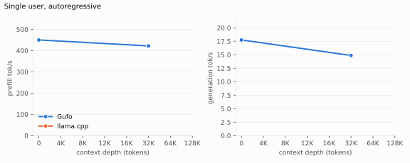

# DeepSeek V4 Flash on Strix Halo

| | |
| --- | --- |
| Host | Linux x86-64, AMD `gfx1151`, 128 GB unified memory; Nix release binaries |
| Target | `antirez/deepseek-v4-gguf` revision `1cd7b564`: `DeepSeek-V4-Flash-IQ2XXS-w2Q2K-AProjQ8-SExpQ8-OutQ8-chat-v2-imatrix-0731.gguf` (80.76 GiB) |
| Speculative | DSpark support `DeepSeek-V4-Flash-DSpark-support-0731.gguf`, revision `e7f04037` |
| Reference | llama.cpp `llama-server` release `b11069`, ROCm gfx1151 from `flake.nix`, same target GGUF and DSpark file through `--spec-type draft-dspark`; all llama.cpp cells are **TODO** until the first HTTP sweep |
| Method | HTTP on both servers, same prompts and timed scope; single-user tables are **pp2048 / tg128** after a cached prefix of the stated depth; `C` is simultaneous requests |
| Gain | Gufo over llama.cpp, positive when Gufo is faster |
| Layout | [benchmark-model skill](../../../.agents/skills/benchmark-model/SKILL.md) |

**Target parity remains open:** the optimized build misses the historical
trajectory gate, and four post-prefill differential alerts remain unresolved.
DSpark replay does not establish target correctness.
[Evidence and limits](EVALUATION.md). Unknown current measurements are **TODO**.

## Loading

Cold-file-cache launch to HTTP readiness on 2026-09-21, including DSpark and
two sessions at context capacity 4096. The integer expert-routing tensor
loads without conversion; serving replay remains exact under the
[state checks](EVALUATION.md).

<!-- bench:loading -->
| Target | Gufo ready | llama.cpp ready | Gain |
| --- | ---: | ---: | ---: |
| Flash 0731 | 36.82 s | TODO | TODO |
<!-- /bench -->


## Single user, autoregressive

Latest depth control: **2026-09-19**, two release measurements at d0/d32K
with `gufo bench`. Values are mean ± standard deviation; initial kernel
setup contributes to depth-zero prefill variation. The final packing layout
needs a d64K speed refresh. Gain uses means.

<!-- bench:single-ar -->
| Depth | Gufo pp | llama.cpp pp | Gain | Gufo tg | llama.cpp tg | Gain |
| ---: | ---: | ---: | ---: | ---: | ---: | ---: |
| 0 | 450.26 ± 33.18 | TODO | TODO | 17.74 ± 0.00 | TODO | TODO |
| 4,096 | TODO | TODO | TODO | TODO | TODO | TODO |
| 8,192 | TODO | TODO | TODO | TODO | TODO | TODO |
| 12,288 | TODO | TODO | TODO | TODO | TODO | TODO |
| 16,384 | TODO | TODO | TODO | TODO | TODO | TODO |
| 32,768 | 422.18 ± 3.61 | TODO | TODO | 14.86 ± 0.00 | TODO | TODO |
| 65,536 | TODO | TODO | TODO | TODO | TODO | TODO |
| 131,072 | TODO | TODO | TODO | TODO | TODO | TODO |
<!-- /bench -->



## Single user, DSpark

Same workload and measurement date: two measurements at d0, one at d32K.
DSpark prefill includes support-state work. The reference column is
llama.cpp with the same DSpark support file (`draft-dspark`).

<!-- bench:single-dspark -->
| Depth | Gufo pp | llama.cpp pp | Gain | Gufo tg | llama.cpp tg | Gain | Gufo accepted/step | llama.cpp accepted/step |
| ---: | ---: | ---: | ---: | ---: | ---: | ---: | ---: | ---: |
| 0 | 453.49 ± 25.96 | TODO | TODO | 17.45 ± 0.00 | TODO | TODO | TODO | TODO |
| 4,096 | TODO | TODO | TODO | TODO | TODO | TODO | TODO | TODO |
| 8,192 | TODO | TODO | TODO | TODO | TODO | TODO | TODO | TODO |
| 12,288 | TODO | TODO | TODO | TODO | TODO | TODO | TODO | TODO |
| 16,384 | TODO | TODO | TODO | TODO | TODO | TODO | TODO | TODO |
| 32,768 | 417.80 | TODO | TODO | 35.30 | TODO | TODO | TODO | TODO |
| 65,536 | TODO | TODO | TODO | TODO | TODO | TODO | TODO | TODO |
| 131,072 | TODO | TODO | TODO | TODO | TODO | TODO | TODO | TODO |
<!-- /bench -->


Repetitive workload (**TODO**): same prefixes and depths, the measured turn
asks the model to repeat the passage word for word, so the output is fully
predictable — the single-user analogue of the `repetition` corpus below.

<!-- bench:single-dspark-repetition -->
| Depth | Gufo pp | llama.cpp pp | Gain | Gufo tg | llama.cpp tg | Gain | Gufo accepted/step | llama.cpp accepted/step |
| ---: | ---: | ---: | ---: | ---: | ---: | ---: | ---: | ---: |
| 0 | TODO | TODO | TODO | TODO | TODO | TODO | TODO | TODO |
| 4,096 | TODO | TODO | TODO | TODO | TODO | TODO | TODO | TODO |
| 8,192 | TODO | TODO | TODO | TODO | TODO | TODO | TODO | TODO |
| 12,288 | TODO | TODO | TODO | TODO | TODO | TODO | TODO | TODO |
| 16,384 | TODO | TODO | TODO | TODO | TODO | TODO | TODO | TODO |
| 32,768 | TODO | TODO | TODO | TODO | TODO | TODO | TODO | TODO |
| 65,536 | TODO | TODO | TODO | TODO | TODO | TODO | TODO | TODO |
| 131,072 | TODO | TODO | TODO | TODO | TODO | TODO | TODO | TODO |
<!-- /bench -->

The CLI uses a repeating token sequence. Natural prompts can have substantially
different acceptance and speed. Depth-zero generation starts from 16 tokens;
it does not follow the measured 2048-token prefill.

## Multiple users

Aggregate delivered output tok/s (`aggregate.output_tokens_per_second.overall`).
Context capacity 4096, greedy, 128 output tokens, `cache_prompt=false`, fresh
server per point. Workloads come from the
[speculative corpus](../qwen3.8-27b/artifacts/speculative-corpus.json):
`repetition` runs `repetition_word`; `mixed` cycles through the distinct
corpus cases. `Exact` counts llama.cpp completions whose hash matches the
Gufo AR C1 reference. The current sweep is **TODO**, including acceptance and
output checks at every concurrency.

<!-- bench:multi-repetition -->
| Users | Gufo AR | llama.cpp AR | Gain | Gufo DSpark | llama.cpp DSpark | Gain | Exact |
| ---: | ---: | ---: | ---: | ---: | ---: | ---: | ---: |
| 1 | TODO | TODO | TODO | TODO | TODO | TODO | TODO |
| 2 | TODO | TODO | TODO | TODO | TODO | TODO | TODO |
| 4 | TODO | TODO | TODO | TODO | TODO | TODO | TODO |
| 6 | TODO | TODO | TODO | TODO | TODO | TODO | TODO |
| 8 | TODO | TODO | TODO | TODO | TODO | TODO | TODO |
<!-- /bench -->

<!-- bench:multi-mixed -->
| Users | Gufo AR | llama.cpp AR | Gain | Gufo DSpark | llama.cpp DSpark | Gain | Exact |
| ---: | ---: | ---: | ---: | ---: | ---: | ---: | ---: |
| 1 | TODO | TODO | TODO | TODO | TODO | TODO | TODO |
| 2 | TODO | TODO | TODO | TODO | TODO | TODO | TODO |
| 4 | TODO | TODO | TODO | TODO | TODO | TODO | TODO |
| 6 | TODO | TODO | TODO | TODO | TODO | TODO | TODO |
| 8 | TODO | TODO | TODO | TODO | TODO | TODO | TODO |
<!-- /bench -->

Latest fixed-prompt sampled HTTP control (2026-09-19, C2, temperature 1,
top-p 0.95, seed 7): **17.40 tok/s per user** for an autumn explanation,
**21.01** for a repeating pattern, and **15.27** for a short naming task.
Two fresh-server measurements; details and limits are in the
[sampling evidence](EVALUATION.md#dspark).

DSpark combines offline cycle costs and acceptance history with checkpoint
confidence for filtered sampled C>1 requests. These use exact hybrid top-8
proposals; C1 and unfiltered sampling retain point-mass proposals. Stochastic
verification preserves the target distribution, with its own seeded trace.
Greedy behavior is unchanged. Requests keep private RNG, proposal, acceptance
and controller state; prefix reuse starts fresh request statistics. Live timing
never changes token decisions.

## Memory

C1 with context capacity **262,144**. GPU-visible unified allocations exclude
separate CPU memory; capacity does not imply filling the window. Gufo values
come from the earlier C1 capacity control with DSpark (the first row was
recorded as pp2048/4096 + tg128); a current refresh is TODO. llama.cpp resident device memory at the same `-c`: **TODO**.

<!-- bench:memory -->
| Workload | Gufo GiB | llama.cpp GiB | Gain |
| --- | ---: | ---: | ---: |
| pp2048 + tg128 | 90.74 | TODO | TODO |
| 16K prefix, pp4096 + tg128 | 91.46 | TODO | TODO |
<!-- /bench -->


Target and support weights, KV and working buffers all contribute. Compressed
KV and score scratch grow with actual use. Prefill reuses scratch across
ordered stages; indexer scoring borrows the idle attention-output range for
temporary F16 keys. Queries share that range and feed WMMA directly.
Persistent KV precision is unchanged.

## Reproduce

```sh
nix build
MODEL=/path/to/target.gguf
DSPARK=/path/to/DSpark-support.gguf
./result/bin/gufo bench --model "$MODEL" \
  -c 1 -p 2048 -n 128 -d 0,32768 -r 2 -v
./result/bin/gufo bench --model "$MODEL" --dspark-model "$DSPARK" \
  -c 1 -p 2048 -n 128 -d 0,32768 -r 2 -v
```

Use `-c 1,2,4,6,8` for concurrency and
`-d 0,4096,8192,12288,16384,32768` for the full depth sweep. Use `-p 4096`
for pp4096. Sampled controls use the same `--temperature` and `--seed` in both
modes. Context preparation and restoration are outside timing. Verbose output
records hashes and draft counts; compare these alongside speed. Run model
jobs, builds and profiles sequentially. `gufo bench` is the kernel-iteration
tool; the published comparison tables are measured over HTTP on both sides
and rendered with `tools/bench/model-bench.py` as described by the
`benchmark-model` skill. Distinguish cold requests from cache hits.
