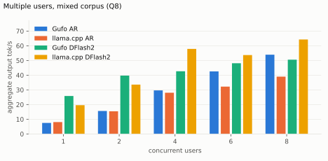
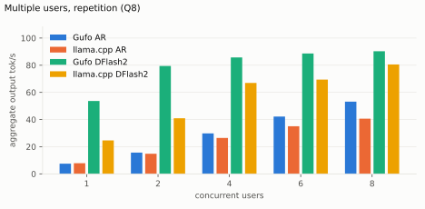
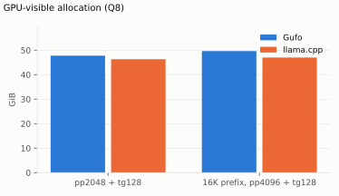

# Qwen3.8 27B on Strix Halo

Linux x86-64, gfx1151, 128 GB unified memory; Nix release binaries.
Measured targets: **UD-Q4_K_XL** (16.35 GiB) and **UD-Q8_K_L** (26.12 GiB;
the unsloth snapshot `4ca72078` ships `Qwen3.8-27B-UD-Q8_K_L.gguf`, so every
Q8 number below is Q8_K_L, not the Q8_K_XL named in earlier revisions of this
card). DFlash2 draft: **Q4_K_M** with the **adaptive** controller. Q8_0 and
BF16 drafts remain supported; a full comparison across context depths is
**TODO**.

PNG/JPEG image input uses the matching BF16 projector with AR or DFlash2.
Native MTP is CLI-only. [Image usage and quality checks](README.md#images).

Reference implementation: **llama.cpp** `llama-server` from this repository's
`flake.nix` (release `b11069`, reported as `0.4.1-dev (build 11069)`, ROCm,
gfx1151, `LLAMA_HIP_UMA=ON`, same GGUF files), measured over HTTP with the
same prompts and timed scope. **Gain** is Gufo over llama.cpp, positive when
Gufo is better. Layout and method:
[benchmark-model skill](../../../.agents/skills/benchmark-model/SKILL.md).

All tables were refreshed **2026-09-21** with `tools/bench/model-bench.py`
at Gufo revision `1589ed79` (dirty tree, `nix build`, binary SHA-256
`73590c9c12fb…`), one target at a time, nothing else on the GPU, fresh server
per table and per concurrency level. Gufo ran
`gufo serve --sessions N llm --context C --think off --max-pending-per-client 8`
(plus `--speculative dflash2 --dflash-model` for DFlash2); llama.cpp ran
`llama-server -ngl 999 -fa on --cache-reuse 0 --jinja --reasoning off -np N -c C`
(plus `--spec-type draft-dflash --spec-draft-model <draft> --spec-draft-ngl 999`
for DFlash2). Greedy, seed 1, thinking off. `tools/qwen27b/check.py fast`
passed (8/8) on the same build before the refresh. Unmeasured points are
**TODO**; the reason is stated next to each table.

## Loading and continuation

The cold-file-cache loading table is **not measured**: the refresh host has
no privileged page-cache drop (`echo 3 > /proc/sys/vm/drop_caches`, no
`sudo`/`doas`), so the driver skipped the table on both targets and the
earlier hand-measured Gufo cells were retired rather than kept next to an
unmeasured reference. Rerun with `--drop-caches "<privileged command>"` on a
host that has one.

<!-- bench:loading -->
| Target | Gufo ready | llama.cpp ready | Gain |
| --- | ---: | ---: | ---: |
| Q4 | TODO | TODO | TODO |
| Q8 | TODO | TODO | TODO |
<!-- /bench -->

Warm-cache readiness during this refresh (not a cold measurement): Gufo
reported `load_completed` after 0.65 s (Q4, context 35456) and 1.23 s (Q4,
context 262144) once the GGUF was in the page cache. A 626-token Q4+DFlash2
prompt snapshot occupies **216 MiB**, independent of unused context
capacity; cancel/continue reused 661 tokens and prefilled 61 new tokens,
restoring the prompt snapshot in **3.13 ms** (2026-09-21 hand controls, not
a long-conversation latency distribution).

## Single user, autoregressive

Standard sweep: **pp2048 / tg128**, C1, greedy. Cells are tok/s from the
servers' own `timings`; depth is a cached conversation prefix (a prior user
turn of about `d` tokens answered with one token), and the timed request
continues that conversation with a new ~2048-token user turn. Synthetic
paragraph text (1.167 tokens/word, 12-token template overhead); the driver
accepted a point only when `cache_n` was within 0.5% of `d` and `prompt_n`
within 0.5% of 2048 (actual counts per sample are in the artifacts).
Context capacity 35456 on both servers for the 0–32K rows; one warmed
sample per point. The 64K and 128K rows (context 133760) are **TODO**.
Artifacts: `artifacts/single-ar-{q4,q8}-{gufo,reference}.json`.

<!-- bench:single-ar-q4 -->
| Depth | Gufo pp | llama.cpp pp | Gain | Gufo tg | llama.cpp tg | Gain |
| ---: | ---: | ---: | ---: | ---: | ---: | ---: |
| 0 | 633.08 | 326.21 | +94.1% | 9.68 | 12.09 | -19.9% |
| 4,096 | 583.61 | 302.46 | +93.0% | 11.70 | 11.92 | -1.8% |
| 8,192 | 553.05 | 287.14 | +92.6% | 11.32 | 11.77 | -3.8% |
| 12,288 | 489.85 | 275.09 | +78.1% | 11.24 | 11.61 | -3.2% |
| 16,384 | 459.05 | 264.36 | +73.6% | 11.03 | 11.45 | -3.7% |
| 32,768 | 415.94 | 228.96 | +81.7% | 10.33 | 10.91 | -5.3% |
| 65,536 | TODO | TODO | TODO | TODO | TODO | TODO |
| 131,072 | TODO | TODO | TODO | TODO | TODO | TODO |
<!-- /bench -->


<!-- bench:single-ar-q8 -->
| Depth | Gufo pp | llama.cpp pp | Gain | Gufo tg | llama.cpp tg | Gain |
| ---: | ---: | ---: | ---: | ---: | ---: | ---: |
| 0 | 679.77 | 317.30 | +114.2% | 6.62 | 8.01 | -17.4% |
| 4,096 | 632.28 | 297.17 | +112.8% | 7.42 | 7.93 | -6.4% |
| 8,192 | 606.46 | 284.36 | +113.3% | 7.34 | 7.86 | -6.6% |
| 12,288 | 533.89 | 273.43 | +95.3% | 7.27 | 7.79 | -6.7% |
| 16,384 | 507.32 | 262.89 | +93.0% | 7.19 | 7.73 | -7.0% |
| 32,768 | 442.06 | 226.12 | +95.5% | 6.90 | 7.48 | -7.8% |
| 65,536 | TODO | TODO | TODO | TODO | TODO | TODO |
| 131,072 | TODO | TODO | TODO | TODO | TODO | TODO |
<!-- /bench -->


Gufo prefill is 1.7–2.1× llama.cpp at every depth; autoregressive decode is
2–8% slower than llama.cpp from 4K onwards. The **depth-0 decode deficit is
larger (−20% Q4, −17% Q8) and reproducible**: a three-sample control
(2026-09-21, same driver, Q4) gave 9.66 ± 0.03 tok/s at d0 against
11.58 ± 0.01 tok/s at d4096, and the server log shows every request that
starts a conversation without a cached prefix (`cache=miss`) decoding at
9.6–9.7 tok/s while continuations of a restored snapshot (`cache=memory`)
decode at 11.6 tok/s. This is a Gufo behavior to investigate, not a driver
artifact.

## Single user, DFlash2

**pp2048 / tg128**, C1, greedy, Q4_K_M draft, adaptive controller, same
prompts, depths and context capacity as the autoregressive table, one warmed
sample per point. llama.cpp `b11069` runs the same draft through
`--spec-type draft-dflash --spec-draft-model <draft> --spec-draft-ngl 999`
with its default draft parameters, so the reference column is a real DFlash2
comparison. Each acceptance column is that server's accepted/proposed draft
ratio; the two drafters propose different block lengths, so compare tg and
read acceptance as a diagnostic. The 64K and 128K rows are **TODO**.
Artifacts: `artifacts/single-dflash2-{q4,q8}-{gufo,reference}.json`.

<!-- bench:single-dflash2-q4 -->
| Depth | Gufo pp | Gufo tg | Gufo acceptance | llama.cpp DFlash2 tg | llama.cpp acceptance | Gain |
| ---: | ---: | ---: | ---: | ---: | ---: | ---: |
| 0 | 544.51 | 23.38 | 43.1% | 27.11 | 66.1% | -13.8% |
| 4,096 | 519.67 | 28.67 | 48.7% | 26.64 | 66.1% | +7.6% |
| 8,192 | 508.39 | 22.43 | 41.4% | 22.44 | 53.1% | -0.0% |
| 12,288 | 459.28 | 21.72 | 41.9% | 22.20 | 52.4% | -2.2% |
| 16,384 | 438.24 | 20.37 | 40.8% | 21.45 | 51.0% | -5.0% |
| 32,768 | 397.08 | 15.86 | 40.2% | 20.54 | 52.4% | -22.8% |
| 65,536 | TODO | TODO | TODO | TODO | TODO | TODO |
| 131,072 | TODO | TODO | TODO | TODO | TODO | TODO |
<!-- /bench -->


<!-- bench:single-dflash2-q8 -->
| Depth | Gufo pp | Gufo tg | Gufo acceptance | llama.cpp DFlash2 tg | llama.cpp acceptance | Gain |
| ---: | ---: | ---: | ---: | ---: | ---: | ---: |
| 0 | 573.39 | 21.38 | 40.4% | 19.14 | 62.1% | +11.7% |
| 4,096 | 544.16 | 17.84 | 30.4% | 19.78 | 65.6% | -9.8% |
| 8,192 | 531.90 | 17.07 | 32.5% | 17.58 | 56.0% | -2.9% |
| 12,288 | 482.49 | 17.11 | 35.6% | 16.32 | 50.0% | +4.8% |
| 16,384 | 461.23 | 14.69 | 29.1% | 16.14 | 51.0% | -9.0% |
| 32,768 | 413.87 | 12.27 | 32.5% | 16.37 | 55.2% | -25.0% |
| 65,536 | TODO | TODO | TODO | TODO | TODO | TODO |
| 131,072 | TODO | TODO | TODO | TODO | TODO | TODO |
<!-- /bench -->


On this synthetic prose the adaptive controller accepts 40–49% (Q4) and
29–40% (Q8) of proposals; Gufo DFlash2 generation is within ±14% of
llama.cpp up to 16K and falls behind by 23–25% at 32K, where Gufo's
speculative decode drops to 15.9 / 12.3 tok/s while llama.cpp holds
20.5 / 16.4 tok/s. Greedy DFlash2 output matches AR token IDs (verified by
the concurrency `Exact` checks below at C1). Natural prompts have different
acceptance and speed; the repetitive corpus below accepts 100%.

Draft-precision control, **2026-09-16**: cached `prose_tides`, **tg64**,
adaptive, greedy C1, one warmed release sample per draft. Generation tok/s:

| Draft | Q4 target | Q8 target |
| --- | ---: | ---: |
| Q4_K_M | **23.51** | **15.61** |
| Q8_0 | 22.66 | 15.33 |
| BF16 | 21.96 | 14.11 |

Full depth comparison across all three drafts and MTP performance: **TODO**.
[Prompts, artifact identities and quality checks](EVALUATION.md).

## Multiple users

Aggregate delivered output tok/s (`aggregate.output_tokens_per_second.overall`):
total output tokens divided by the sum of measured request-group spans.
Context capacity 4096 per user (Gufo `--sessions C --context 4096`, llama.cpp
`-np C -c 4096·C`), greedy, thinking off, **128 output tokens**, one warmup
round, one measured repetition, fresh server per concurrency level. Workloads
come from the [speculative corpus](artifacts/speculative-corpus.json):
`repetition` runs `repetition_word` on every user; `mixed` cycles through the
nine distinct corpus cases. DFlash2 uses the Q4_K_M draft on both servers
(Gufo adaptive controller; llama.cpp `draft-dflash` defaults). `Exact` counts
llama.cpp AR completions whose hash matches the Gufo AR C1 reference; every
Gufo DFlash2 completion matched that reference at every concurrency.
Artifacts: `artifacts/multi-{mixed,repetition}-{q4,q8}-{gufo-ar,gufo-dflash2,reference,reference-dflash2}.json`.

Prompt-cache mismatch: the driver sends `cache_prompt=false`, which
llama-server honours (0 cache hits) but Gufo ignores, so Gufo reused its
prompt snapshot for repeated prompts (all `repetition` requests; 14 of 16
`mixed` requests at C8). The prompts are 30–53 tokens, so the skipped
prefill is about 0.2 s of a 15–19 s request (≈1–2% of the Gufo AR span);
llama.cpp's C8 prefill of the same prompts takes 1.4–1.5 s per request. The
`summary_gpu` case stops at EOS after 34–38 tokens on both servers; all other
completions reach 128 tokens.

<!-- bench:multi-mixed-q4 -->
| Users | Gufo AR | llama.cpp AR | Gain | Gufo DFlash2 | llama.cpp DFlash2 | Gain | Exact |
| ---: | ---: | ---: | ---: | ---: | ---: | ---: | ---: |
| 1 | 11.47 | 11.81 | -2.9% | 28.95 | 23.80 | +21.6% | 3/9 |
| 2 | 20.41 | 19.96 | +2.3% | 34.70 | 29.39 | +18.1% | 5/10 |
| 4 | 37.15 | 33.50 | +10.9% | 42.15 | 49.91 | -15.5% | 8/12 |
| 6 | 50.02 | 32.75 | +52.7% | 43.76 | 46.45 | -5.8% | 8/12 |
| 8 | 61.07 | 32.21 | +89.6% | 47.56 | 43.88 | +8.4% | 11/16 |
<!-- /bench -->


<!-- bench:multi-repetition-q4 -->
| Users | Gufo AR | llama.cpp AR | Gain | Gufo DFlash2 | llama.cpp DFlash2 | Gain | Exact |
| ---: | ---: | ---: | ---: | ---: | ---: | ---: | ---: |
| 1 | 11.77 | 11.78 | -0.1% | 65.04 | 33.04 | +96.9% | 1/1 |
| 2 | 22.97 | 21.40 | +7.3% | 88.09 | 42.46 | +107.5% | 2/2 |
| 4 | 41.65 | 35.92 | +16.0% | 95.22 | 79.15 | +20.3% | 4/4 |
| 6 | 56.33 | 41.76 | +34.9% | 95.51 | 81.90 | +16.6% | 6/6 |
| 8 | 67.05 | 42.95 | +56.1% | 98.54 | 93.84 | +5.0% | 8/8 |
<!-- /bench -->


Q4 at C8, request latency median / p95: Gufo AR 15.0 / 15.2 s, Gufo DFlash2
14.6 / 19.4 s, llama.cpp AR 28.9 / 28.9 s, llama.cpp DFlash2 17.4 / 21.4 s
(mixed); Gufo AR 15.3 s, Gufo DFlash2 10.4 s, llama.cpp AR 23.8 s, llama.cpp
DFlash2 10.9 s (repetition, all requests identical). Gufo DFlash2 acceptance
is 49.6–54.2% on the mixed corpus and 100% on repetition at every
concurrency; llama.cpp accepts 60–64% on mixed. The mixed `Exact` counts show
that llama.cpp's greedy text diverges from Gufo's in most distinct cases
(3 of 9 identical at C1), so those throughputs compare equal token budgets,
not identical outputs. Gufo AR scales to 1.9× llama.cpp at C8; Gufo DFlash2
leads llama.cpp DFlash2 at C1–C2 and C8 but not at C4–C6 on the mixed
corpus, and above C4 delivers less than Gufo AR, so the **100 tok/s at C2 /
150 tok/s at C4** targets remain unmet on mixed prompts (repetition reaches
88 / 95 tok/s).

<!-- bench:multi-mixed-q8 -->
| Users | Gufo AR | llama.cpp AR | Gain | Gufo DFlash2 | llama.cpp DFlash2 | Gain | Exact |
| ---: | ---: | ---: | ---: | ---: | ---: | ---: | ---: |
| 1 | 7.40 | 7.86 | -5.9% | 22.21 | 17.66 | +25.8% | 4/9 |
| 2 | 14.01 | 13.75 | +1.9% | 29.44 | 26.25 | +12.2% | 6/10 |
| 4 | 26.98 | 24.70 | +9.2% | 33.01 | 41.61 | -20.7% | 4/12 |
| 6 | 37.71 | 26.23 | +43.8% | 35.29 | 37.50 | -5.9% | 3/12 |
| 8 | 47.98 | 30.90 | +55.3% | 37.00 | 39.35 | -6.0% | 4/16 |
<!-- /bench -->



<!-- bench:multi-repetition-q8 -->
| Users | Gufo AR | llama.cpp AR | Gain | Gufo DFlash2 | llama.cpp DFlash2 | Gain | Exact |
| ---: | ---: | ---: | ---: | ---: | ---: | ---: | ---: |
| 1 | 7.50 | 7.85 | -4.5% | 53.72 | 24.62 | +118.2% | 1/1 |
| 2 | 15.66 | 14.82 | +5.7% | 79.55 | 40.95 | +94.3% | 2/2 |
| 4 | 29.83 | 26.46 | +12.7% | 86.16 | 66.94 | +28.7% | 4/4 |
| 6 | 42.18 | 35.07 | +20.3% | 87.35 | 69.40 | +25.9% | 6/6 |
| 8 | 53.14 | 40.65 | +30.7% | 90.65 | 80.57 | +12.5% | 8/8 |
<!-- /bench -->



Q8 at C8, request latency median / p95: Gufo AR 19.2 / 19.4 s, Gufo DFlash2
18.3 / 25.2 s, llama.cpp AR 24.9 / 35.5 s, llama.cpp DFlash2 17.0 / 23.6 s
(mixed); Gufo AR 19.3 s, Gufo DFlash2 11.3 s, llama.cpp AR 25.2 s, llama.cpp
DFlash2 12.7 s (repetition). Gufo DFlash2 acceptance is 40.7–44.7% on mixed
and 100% on repetition; llama.cpp accepts 59–64% on mixed. Q8 follows the Q4
pattern with lower absolute rates: Gufo AR leads from C2, Gufo DFlash2 trails
llama.cpp DFlash2 at C4–C8 on mixed prompts.

Earlier tg64 short-generation controls (2026-09-15/16, `prose_tides` and a
24-request mixed corpus) and the 2026-09-16 one-process-per-sweep tables
remain in Git history; they used different workloads or server lifecycles
and are not comparable with the tables above. Physical widths, output hashes
and acceptance counts are checked at every concurrency; C1 controls must
retain their performance. Controller and verification details:
[evaluation](EVALUATION.md).

## Memory

Peak device-wide VRAM + GTT use from `rocm-smi --showmeminfo vram gtt`,
sampled every 250 ms while the request ran (idle baseline 0.17 GiB), C1,
context capacity 262144 on both servers, both autoregressive, no draft and
no projector loaded. llama.cpp preallocates its whole KV cache at `-c`, so
its footprint does not change with the prefix.
Artifacts: `artifacts/memory-{q4,q8}-{gufo,reference}.json`.

<!-- bench:memory-q4 -->
| Workload | Gufo GiB | llama.cpp GiB | Gain |
| --- | ---: | ---: | ---: |
| pp2048 + tg128 | 19.35 | 32.68 | +68.9% |
| 16K prefix, pp4096 + tg128 | 21.24 | 32.68 | +53.9% |
<!-- /bench -->


<!-- bench:memory-q8 -->
| Workload | Gufo GiB | llama.cpp GiB | Gain |
| --- | ---: | ---: | ---: |
| pp2048 + tg128 | 19.37 | 41.68 | +115.2% |
| 16K prefix, pp4096 + tg128 | 21.26 | 41.69 | +96.1% |
<!-- /bench -->



**Metric caveat.** The `rocm-smi` counter does not see Gufo's weight
mapping: the Gufo Q4 and Q8 peaks differ by 0.02 GiB although the weights
differ by 9.8 GiB, whereas the llama.cpp step (32.7 → 41.7 GiB) tracks the
weight size. Gufo's own loader log reports `gpu_device_used_mib` 38208
(Q4) and 48209 (Q8) at readiness with context 262144, and the process RSS
was 17.3 / 27.3 GiB. Read the Gufo column as request state plus scratch
visible to the driver, not as total footprint; the Gain column is therefore
not a like-for-like comparison until the driver samples a counter that
covers both allocation paths.

## Image encoder

Warm `mmproj-BF16.gguf` encoding, measured **2026-09-20** by hand; excludes
image preprocessing, first weight upload and language-model prefill. Q4 and
Q8 use the same projector. Embeddings are byte-identical to the prior
encoder; see [experiments](EXPERIMENTS.md). The driver does not automate
this table yet, so the 1024×1024 Gufo cell is the retained hand
measurement, the 256×256 cell and the llama.cpp `--mmproj` encode with the
same file remain **TODO**.

<!-- bench:image-encoder -->
| RGB image | Merged tokens | Gufo ms | llama.cpp ms | Gain |
| --- | ---: | ---: | ---: | ---: |
| 256×256 | 64 | TODO | TODO | TODO |
| 1024×1024 | 1024 | 1252 | TODO | TODO |
<!-- /bench -->


## Reproduce and maintain quality

```sh
nix build
nix develop -c python3 tools/qwen27b/check.py fast
Q4=/path/to/Qwen3.8-27B-UD-Q4_K_XL.gguf
Q8=/path/to/Qwen3.8-27B-UD-Q8_K_L.gguf
DRAFT=/path/to/Qwen3.8-27B-DFlash2-Q4_K_M.gguf
MMPROJ=/path/to/mmproj-BF16.gguf
FILES="--gguf q4=$Q4 --gguf q8=$Q8 --draft $DRAFT --mmproj $MMPROJ"
Q4_TABLES=single-ar-q4,single-dflash2-q4,memory-q4,multi-repetition-q4,multi-mixed-q4
Q8_TABLES=single-ar-q8,single-dflash2-q8,memory-q8,multi-repetition-q8,multi-mixed-q8
nix develop -c python3 tools/bench/model-bench.py --model qwen3.8-27b $FILES \
  run --target gufo --table $Q4_TABLES
nix develop -c python3 tools/bench/model-bench.py --model qwen3.8-27b $FILES \
  run --target reference --table $Q4_TABLES
nix develop -c python3 tools/bench/model-bench.py --model qwen3.8-27b $FILES \
  run --target gufo --table $Q8_TABLES
nix develop -c python3 tools/bench/model-bench.py --model qwen3.8-27b $FILES \
  run --target reference --table $Q8_TABLES
# Loading table, only on a host with a privileged page-cache drop:
#   ... run --target gufo --table loading --drop-caches "doas sh -c 'sync; echo 3 > /proc/sys/vm/drop_caches'"
nix develop -c python3 tools/bench/model-bench.py --model qwen3.8-27b render
```

Run Gufo before llama.cpp for the concurrency tables: the reference `Exact`
column compares against the Gufo AR C1 artifact. The 2026-09-21 refresh took
34 min (Gufo Q4), 39 min (llama.cpp Q4), 41 min (Gufo Q8) and 47 min
(llama.cpp Q8) of driver wall time. `gufo bench` is greedy and C1 and is the
kernel-iteration tool; published comparison tables are measured over HTTP on
both sides. Add `--todo` to refresh only rows with `TODO` cells. DFlash2
prefill includes feature capture and draft context injection.

Start with `nix develop -c python3 tools/qwen27b/check.py fast`, then run the
[affected quality checks](EVALUATION.md) before publishing speed. Greedy
speculation must match AR IDs; sampled verification must preserve the target
distribution and reproduce seeded runs within the same configuration.
Independent original-target/MTP qualification: **TODO**.

Optimization targets: **depth-0 and deep-context (32K) generation, DFlash2
generation at C4–C8 on mixed prompts, and Q4/Q8 generation at C2–C8 with and
without DFlash2**. C1 must retain its performance. Track aggregate
throughput, per-user latency, physical batch width, output correctness and
seeded sampling at every concurrency level. Screen changes with short runs;
check retained changes across C1/2/4/6/8 before publishing speed.
