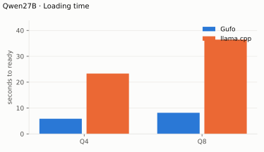
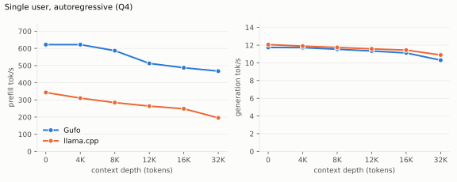
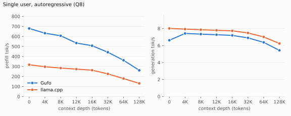
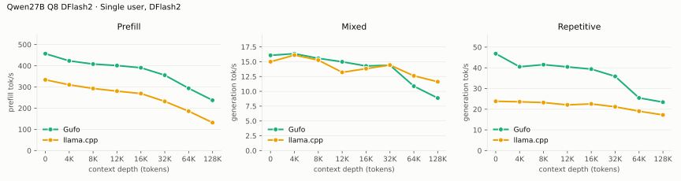
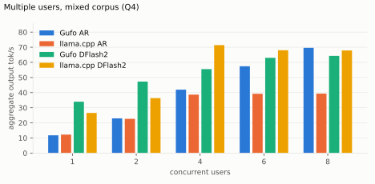
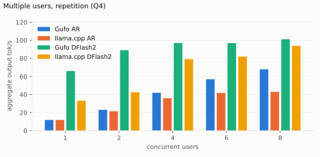
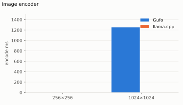

# Qwen3.8 27B on Strix Halo

Linux x86-64, gfx1151, 128 GB unified memory; Nix release binaries.
Production targets: **UD-Q4_K_XL / UD-Q8_K_XL**. Recommended DFlash2 draft:
**Q4_K_M**, with **adaptive** as the default controller. Q8_0 and BF16 drafts
remain supported; a full comparison across context depths is **TODO**.

PNG/JPEG image input uses the matching BF16 projector with AR or DFlash2.
Native MTP is CLI-only. [Image usage and quality checks](README.md#images).

Reference implementation: **llama.cpp** `llama-server` from this repository's
`flake.nix` (ROCm, gfx1151, same GGUF files), measured over HTTP with the same
prompts and timed scope. **Gain** is Gufo over llama.cpp, positive when Gufo
is faster; `Gain vs llama.cpp AR` compares DFlash2 against llama.cpp without
a draft. Layout and method: [benchmark-model skill](../../../.agents/skills/benchmark-model/SKILL.md).

Each table identifies its workload and measurement date. Unmeasured points
are **TODO**.

## Loading and continuation

2026-09-21, one cold-file-cache launch to HTTP readiness, including Q4_K_M
DFlash2 and two sessions at context capacity 262144. llama.cpp readiness
with the same GGUF: **TODO** (the 2026-09-21 refresh host has no privileged
page-cache drop, so the driver's loading table was skipped).

<!-- bench:loading -->
| Target | Gufo ready | llama.cpp ready | Gain |
| --- | ---: | ---: | ---: |
| Q4 | 6.38 s | TODO | TODO |
| Q8 | 8.60 s | TODO | TODO |
<!-- /bench -->



A 626-token Q4+DFlash2 prompt snapshot occupies **216 MiB**, independent of
unused context capacity. Cancel/continue reused 661 tokens and prefilled
61 new tokens; restoring the prompt snapshot took **3.13 ms**.
These are bounded controls, not a long-conversation latency distribution.

## Single user, autoregressive

Standard sweep: **pp2048 / tg128**, C1, greedy. Cells are tok/s; depth is a
cached prefix, and the timed operation follows it. Q4 rows 4,096–16,384
(Gufo) and every Q4 llama.cpp cell were measured **2026-09-21** over HTTP
with `tools/bench/model-bench.py` (synthetic-paragraph prefix, one warmed
sample per point, context capacity 34944; llama.cpp d32768 needed 36864
because the calibrated prefix plus pp2048 + tg128 overflowed 34944), against
`llama-server` 10273 (`a6aa6f5`) with
`-ngl 999 -np 1 -fa on --cache-reuse 0 --jinja --reasoning off`.
Gufo Q4 d0 and d32768 and all Q8 values still date from **2026-09-19**
`gufo bench` runs with a different prompt (Q4 d0 is the mean of two controls,
PP range 620.38–623.61 tok/s); their Gain cells compare two methods and are
provisional until those rows are refreshed over HTTP.

<!-- bench:single-ar-q4 -->
| Depth | Gufo pp | llama.cpp pp | Gain | Gufo tg | llama.cpp tg | Gain |
| ---: | ---: | ---: | ---: | ---: | ---: | ---: |
| 0 | 622.00 | 343.18 | +81.2% | 11.74 | 12.06 | -2.7% |
| 4,096 | 622.04 | 310.23 | +100.5% | 11.72 | 11.89 | -1.4% |
| 8,192 | 586.75 | 284.36 | +106.3% | 11.54 | 11.74 | -1.7% |
| 12,288 | 512.65 | 263.88 | +94.3% | 11.34 | 11.58 | -2.1% |
| 16,384 | 487.32 | 248.50 | +96.1% | 11.12 | 11.44 | -2.8% |
| 32,768 | 467.63 | 195.39 | +139.3% | 10.30 | 10.89 | -5.4% |
<!-- /bench -->



<!-- bench:single-ar-q8 -->
| Depth | Gufo pp | llama.cpp pp | Gain | Gufo tg | llama.cpp tg | Gain |
| ---: | ---: | ---: | ---: | ---: | ---: | ---: |
| 0 | 445.86 | TODO | TODO | 7.11 | TODO | TODO |
| 4,096 | TODO | TODO | TODO | TODO | TODO | TODO |
| 8,192 | TODO | TODO | TODO | TODO | TODO | TODO |
| 12,288 | TODO | TODO | TODO | TODO | TODO | TODO |
| 16,384 | TODO | TODO | TODO | TODO | TODO | TODO |
| 32,768 | TODO | TODO | TODO | TODO | TODO | TODO |
<!-- /bench -->



## Single user, DFlash2

**pp2048 / tg128**, C1, greedy, Q4_K_M draft and adaptive controller.
Q4 depths 0–16,384 measured **2026-09-21** over HTTP with the same
synthetic-paragraph prompts as the autoregressive table (acceptance
41–49% on that text). The Q4 32K row and all Q8 values are **2026-09-19**
`gufo bench` runs on the repetitive CLI input (96.5% acceptance); its Gain
cell against the HTTP llama.cpp number is not a like-for-like comparison.
One warmed sample per point. llama.cpp has no DFlash2 equivalent: the
reference column is llama.cpp autoregressive generation with the same target
GGUF, taken from the autoregressive table above.

<!-- bench:single-dflash2-q4 -->
| Depth | Gufo pp | Gufo tg | Acceptance | llama.cpp AR tg | Gain vs llama.cpp AR |
| ---: | ---: | ---: | ---: | ---: | ---: |
| 0 | 572.72 | 23.83 | 43.1% | 12.06 | +97.6% |
| 4,096 | 530.83 | 29.21 | 48.7% | 11.89 | +145.7% |
| 8,192 | 530.12 | 22.76 | 41.4% | 11.74 | +93.9% |
| 12,288 | 471.71 | 22.05 | 41.9% | 11.58 | +90.4% |
| 16,384 | 456.53 | 20.54 | 40.8% | 11.44 | +79.5% |
| 32,768 | 442.86 | 31.01 | 96.5% | 10.89 | +184.8% |
<!-- /bench -->


<!-- bench:single-dflash2-q8 -->
| Depth | Gufo pp | Gufo tg | Acceptance | llama.cpp AR tg | Gain vs llama.cpp AR |
| ---: | ---: | ---: | ---: | ---: | ---: |
| 0 | 464.32 | 25.03 | TODO | TODO | TODO |
| 4,096 | TODO | TODO | TODO | TODO | TODO |
| 8,192 | TODO | TODO | TODO | TODO | TODO |
| 12,288 | TODO | TODO | TODO | TODO | TODO |
| 16,384 | TODO | TODO | TODO | TODO | TODO |
| 32,768 | TODO | TODO | TODO | TODO | TODO |
<!-- /bench -->



The repetitive Q4 CLI input accepts 96.5% of proposals at d32768.
Greedy outputs match AR. Natural prompts have different acceptance and speed.

Draft-precision control, **2026-09-16**: cached `prose_tides`, **tg64**,
adaptive, greedy C1, one warmed release sample per draft. Generation tok/s:

| Draft | Q4 target | Q8 target |
| --- | ---: | ---: |
| Q4_K_M | **23.51** | **15.61** |
| Q8_0 | 22.66 | 15.33 |
| BF16 | 21.96 | 14.11 |

Full depth comparison across all three drafts and MTP performance: **TODO**.
[Prompts, artifact identities and quality checks](EVALUATION.md).

## Multiple users

Aggregate delivered output tok/s (`aggregate.output_tokens_per_second.overall`):
total output tokens divided by the sum of measured request-group spans.
Context capacity 4096, greedy, thinking off, **128 output tokens**,
`cache_prompt=false`, one warmup round. Workloads come from the
[speculative corpus](artifacts/speculative-corpus.json): `repetition` runs
`repetition_word`; `mixed` cycles through the nine distinct corpus cases.
DFlash2 uses the Q4_K_M draft with the adaptive controller. `Exact` counts
llama.cpp completions whose hash matches the Gufo AR C1 reference; low
counts mean the two servers produced different greedy text, so their
throughput is comparable but their outputs are not.

Measured **2026-09-16** at Gufo revision `61008879` against
`llama-server` 10063 (`7d56da7`, nixpkgs) with
`-ngl 999 -np 8 -c 32768 -fa on --cache-reuse 0 --jinja --reasoning off`,
one server process for each whole sweep. Retained artifacts:
`artifacts/{gufo-ar,gufo-dflash2,llama-server}-{mixed,repetition}.json`.
A refresh with the current binaries and a fresh server per point is **TODO**.

<!-- bench:multi-mixed-q4 -->
| Users | Gufo AR | llama.cpp AR | Gain | Gufo DFlash2 | Gain vs llama.cpp AR | Exact |
| ---: | ---: | ---: | ---: | ---: | ---: | ---: |
| 1 | 11.72 | 11.67 | +0.4% | 29.31 | +151.2% | 18/27 |
| 2 | 20.99 | 12.47 | +68.3% | 36.10 | +189.5% | 12/30 |
| 4 | 38.95 | 17.86 | +118.1% | 43.74 | +144.9% | 2/36 |
| 6 | 53.42 | 17.73 | +201.3% | 45.90 | +158.9% | 0/36 |
| 8 | 62.99 | 24.67 | +155.3% | 47.56 | +92.8% | 0/48 |
<!-- /bench -->



<!-- bench:multi-repetition-q4 -->
| Users | Gufo AR | llama.cpp AR | Gain | Gufo DFlash2 | Gain vs llama.cpp AR | Exact |
| ---: | ---: | ---: | ---: | ---: | ---: | ---: |
| 1 | 11.84 | 11.70 | +1.2% | 43.77 | +274.1% | 3/6 |
| 2 | 23.07 | 11.41 | +102.2% | 48.92 | +328.7% | 2/6 |
| 4 | 41.88 | 20.10 | +108.4% | 57.89 | +188.0% | 5/12 |
| 6 | 56.76 | 23.35 | +143.1% | 59.78 | +156.0% | 9/18 |
| 8 | 67.77 | 29.35 | +130.9% | 65.16 | +122.0% | 8/24 |
<!-- /bench -->



DFlash2 acceptance is 49.6–54.2% on the mixed corpus and 71.1% on
repetition at every concurrency. Above C4 DFlash2 delivers less aggregate
throughput than Gufo AR: target quantized projections are the main scaling
limit. C1 DFlash2 already verifies seven or eight positions together; C2/C4
increase that work to 14–16/28–32 positions, and larger batches bring limited
additional throughput. The **100 tok/s at C2 / 150 tok/s at C4** targets
remain unmet.

<!-- bench:multi-mixed-q8 -->
| Users | Gufo AR | llama.cpp AR | Gain | Gufo DFlash2 | Gain vs llama.cpp AR | Exact |
| ---: | ---: | ---: | ---: | ---: | ---: | ---: |
| 1 | TODO | TODO | TODO | TODO | TODO | TODO |
| 2 | TODO | TODO | TODO | TODO | TODO | TODO |
| 4 | TODO | TODO | TODO | TODO | TODO | TODO |
| 6 | TODO | TODO | TODO | TODO | TODO | TODO |
| 8 | TODO | TODO | TODO | TODO | TODO | TODO |
<!-- /bench -->

<!-- bench:multi-repetition-q8 -->
| Users | Gufo AR | llama.cpp AR | Gain | Gufo DFlash2 | Gain vs llama.cpp AR | Exact |
| ---: | ---: | ---: | ---: | ---: | ---: | ---: |
| 1 | TODO | TODO | TODO | TODO | TODO | TODO |
| 2 | TODO | TODO | TODO | TODO | TODO | TODO |
| 4 | TODO | TODO | TODO | TODO | TODO | TODO |
| 6 | TODO | TODO | TODO | TODO | TODO | TODO |
| 8 | TODO | TODO | TODO | TODO | TODO | TODO |
<!-- /bench -->

Earlier tg64 short-generation controls (2026-09-15/16, `prose_tides` and a
24-request mixed corpus) remain in Git history; they used a different
workload and are not comparable with the tables above. Physical widths,
output hashes and acceptance counts are checked at every concurrency; C1
controls must retain their performance. Controller and verification details:
[evaluation](EVALUATION.md).

## Memory

GPU-visible unified allocation, C1, context capacity 262144, excluding
separate CPU memory. Q4 measured **2026-09-21**: peak device-wide VRAM + GTT
use from `rocm-smi`, sampled every 250 ms while the request ran (idle
baseline 0.17 GiB). The Gufo server ran with the Q4_K_M DFlash2 draft loaded
and the BF16 projector attached; llama.cpp ran autoregressive at the same
`-c` and preallocates the whole KV cache, so its footprint does not change
with the prefix. Q8: **TODO**.

<!-- bench:memory-q4 -->
| Workload | Gufo GiB | llama.cpp GiB | Gain |
| --- | ---: | ---: | ---: |
| pp2048 + tg128 | 21.31 | 32.37 | +51.9% |
| 16K prefix, pp4096 + tg128 | 23.21 | 32.37 | +39.5% |
<!-- /bench -->


<!-- bench:memory-q8 -->
| Workload | Gufo GiB | llama.cpp GiB | Gain |
| --- | ---: | ---: | ---: |
| pp2048 + tg128 | TODO | TODO | TODO |
| 16K prefix, pp4096 + tg128 | TODO | TODO | TODO |
<!-- /bench -->

## Image encoder

Warm `mmproj-BF16.gguf` encoding, measured **2026-09-20**; excludes image
preprocessing, first weight upload and language-model prefill. Q4 and Q8 use
the same projector. Embeddings are byte-identical to the prior encoder; see
[experiments](EXPERIMENTS.md). llama.cpp `--mmproj` encode with the same
file: **TODO**.

<!-- bench:image-encoder -->
| RGB image | Merged tokens | Gufo ms | llama.cpp ms | Gain |
| --- | ---: | ---: | ---: | ---: |
| 256×256 | 64 | TODO | TODO | TODO |
| 1024×1024 | 1024 | 1252 | TODO | TODO |
<!-- /bench -->



## Reproduce and maintain quality

```sh
nix build
MODEL=/path/to/Qwen3.8-27B-UD-Q4_K_XL.gguf
DRAFT=/path/to/Qwen3.8-27B-DFlash2-Q4_K_M.gguf
./result/bin/gufo bench --model "$MODEL" \
  -p 2048 -n 128 -d 0,4096,8192,12288,16384,32768 -c 1 -r 2 -v
./result/bin/gufo bench --model "$MODEL" \
  --speculative dflash2 --dflash-model "$DRAFT" \
  -p 2048 -n 128 -d 0,4096,8192,12288,16384,32768 -c 1 -r 2 -v
MMPROJ=/path/to/mmproj-BF16.gguf
FILES="--gguf q4=$MODEL --draft q4=$DRAFT --mmproj $MMPROJ"
nix develop -c python3 tools/bench/model-bench.py --model qwen3.8-27b $FILES \
  run --target gufo --todo --table single-ar-q4,single-dflash2-q4,memory-q4
nix develop -c python3 tools/bench/model-bench.py --model qwen3.8-27b $FILES \
  run --target reference --todo --table single-ar-q4,memory-q4
nix develop -c python3 tools/bench/model-bench.py --model qwen3.8-27b render
```

`gufo bench` is greedy and C1 and is the kernel-iteration tool. Published
comparison tables are measured over HTTP on both sides and rendered with
`tools/bench/model-bench.py` (`run --target gufo`, `run --target reference`,
`render`); the `benchmark-model` skill describes the workloads, artifacts and
table layout. Drop `--todo` to refresh whole tables; add `q8=` file entries
for the Q8 tables. DFlash2 prefill includes feature capture and draft context
injection.

Start with `nix develop -c python3 tools/qwen27b/check.py fast`, then run the
[affected quality checks](EVALUATION.md) before publishing speed. Greedy
speculation must match AR IDs; sampled verification must preserve the target
distribution and reproduce seeded runs within the same configuration.
Independent original-target/MTP qualification and the full context/concurrency
sweep: **TODO**.

Optimization targets: **prefill scaling with context, and Q4/Q8 generation
at C2, C4, C6 and C8 with and without DFlash2**. C1 must retain its performance. Track aggregate
throughput, per-user latency, physical batch width, output correctness and
seeded sampling at every concurrency level. Screen changes with short runs;
check retained changes across C1/2/4/6/8 before publishing speed.
