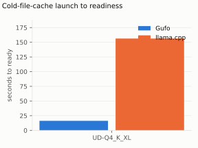
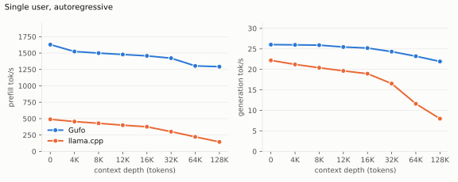
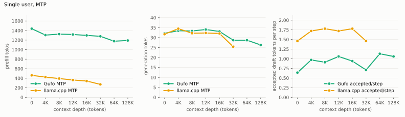
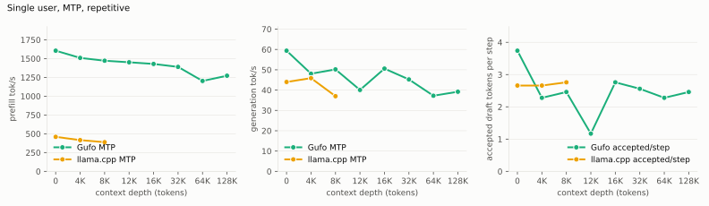
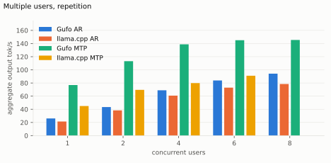
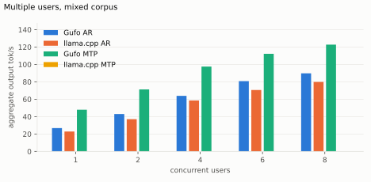
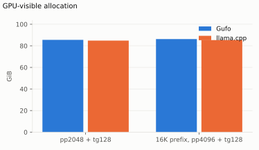
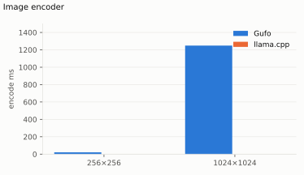

# Qwen3.8-Flash-Next on Strix Halo

| | |
| --- | --- |
| Host | Linux x86-64, AMD `gfx1151`, 128 GB unified memory |
| Gufo | `nix build` at revision `89d58eb7`, binary SHA-256 `4b1e592acb7e4a56…` |
| Target | `unsloth/Qwen3.8-Flash-Next-GGUF` revision `38bb39ee`, **UD-Q4_K_XL** (four shards, 103.7 GiB) |
| Speculative | MTP sidecar `mtp-Qwen3.8-Flash-Next-shared-Q8_0.gguf`, same revision, adaptive up to 7 proposals |
| Reference | llama.cpp `llama-server` release `b11069` (`0.4.1-dev (build 11069, commit 68d9053a)`), ROCm gfx1151 from `flake.nix`, same GGUF; cannot load the MTP sidecar |
| Method | HTTP on both servers, same prompts and timed scope, greedy, thinking off, one sample per point, fresh server per table and concurrency level; `tools/bench/model-bench.py`, 2026-09-22. Every artifact records its server command |
| Gain | Gufo over llama.cpp, positive when Gufo is better |
| Identities | [`artifacts/model-identities.json`](artifacts/model-identities.json) |
| Layout | [benchmark-model skill](../../../.agents/skills/benchmark-model/SKILL.md) |

Chat follows the official template (thinking on, `xhigh` effort, prior
reasoning preserved); the benchmarks run with thinking off. PNG/JPEG input
works with AR/MTP and `mmproj-BF16.gguf`; see
[image usage and validation](README.md#images). **Original
unquantized-model and GGUF-conversion parity remain unqualified.** This
model has no fast correctness suite; the driver's checks (128 generated
tokens per single-user sample, MTP completion hashes against the Gufo AR C1
reference) are the correctness gates of this refresh. Unmeasured cells are
**TODO**; the reason is stated next to each table.

## Loading

Cold-file-cache launch to `/ready`, measured 2026-09-22 after
`sync; echo 3 > /proc/sys/vm/drop_caches`, one launch per server. Gufo loaded
the four shards plus the MTP sidecar with two sessions at context capacity
262144. llama.cpp loaded the same shards at `-c 35456` (the capacity of its
depth rows): at `-c 262144` it preallocates the whole KV cache for this
104 GiB model and the kernel OOM-killed it before readiness, so its number
is for a smaller window. Gufo maps the weights lazily, which is why its
cold and warm readiness differ little.

<!-- bench:loading -->
| Target | Gufo ready | llama.cpp ready | Gain |
| --- | ---: | ---: | ---: |
| UD-Q4_K_XL | 16.30 s | 156.35 s | +859.2% |
<!-- /bench -->



Warm-cache readiness for comparison: Gufo logged `load_completed` after
**15.6 s** (AR, context 133760) and **16.2 s** (MTP), with
`gpu_device_used_mib` 86940 (AR) and 89892 (MTP). A 4084-token AR prompt
snapshot occupied 212 MiB; restore/replay qualification is in
[evaluation](EVALUATION.md).

## Single user, autoregressive

Standard sweep: **pp2048 / tg128**, C1, greedy. Cells are tok/s from the
servers' own `timings` (`prompt_n` / `prompt_ms`, `predicted_n` /
`predicted_ms`). Depth is a cached conversation prefix: the driver sends a
user turn of about `d` tokens answered with an 8-token generated reply, then
the timed request continues that conversation with a new ~2048-token user
turn that asks for a long continuation, and 128 output tokens. Gufo ran
every depth at context capacity 133760. llama.cpp ran d0–32K at 35456 and
64K at 68224 because at `-c 133760` its resident set (103.7 GiB of mapped
weights plus 33 GiB of KV and compute buffers) exceeded the 125 GiB of RAM
and the kernel OOM-killed it during the 12K prefix; the 128K row is
therefore **not measurable for llama.cpp on this host** and stays TODO.
Artifacts: `artifacts/single-ar-gufo.json`, `artifacts/single-ar-reference.json`.

<!-- bench:single-ar -->
| Depth | Gufo pp | llama.cpp pp | Gain | Gufo tg | llama.cpp tg | Gain |
| ---: | ---: | ---: | ---: | ---: | ---: | ---: |
| 0 | 1628.52 | 490.33 | +232.1% | 26.04 | 22.11 | +17.8% |
| 4,096 | 1523.39 | 428.50 | +255.5% | 25.98 | 21.18 | +22.7% |
| 8,192 | 1499.13 | 422.44 | +254.9% | 25.91 | 20.35 | +27.3% |
| 12,288 | 1477.98 | 395.59 | +273.6% | 25.46 | 18.72 | +36.0% |
| 16,384 | 1457.16 | 378.65 | +284.8% | 25.20 | 18.96 | +32.9% |
| 32,768 | 1421.93 | 306.77 | +363.5% | 24.33 | 16.07 | +51.4% |
| 65,536 | 1304.01 | 224.90 | +479.8% | 23.21 | 11.86 | +95.7% |
| 131,072 | 1292.02 | TODO | TODO | 21.93 | TODO | TODO |
<!-- /bench -->



Gufo prefills **3.3× faster** than llama.cpp at d0 (1628.5 vs 490.3 tok/s)
and the gap widens with depth to **5.8×** at 64K (1304.0 vs 224.9); Gufo AR
prefill falls 21% from d0 to d128K. Gufo decodes 18% faster at d0 and
**96% faster at 64K** (23.2 vs 11.9 tok/s): llama.cpp's decode halves over
the sweep while Gufo's loses 16%. The first turn of a fresh conversation is
a prompt-cache miss on Gufo and is a different regime from a cached
continuation.

## Single user, MTP

Same workload with `--speculative mtp --mtp-model <mtp>` (adaptive, up to 7
proposals). Gufo pp includes predictor catch-up. `accepted/step` is the mean
number of accepted draft tokens per verification step
(`draft_tokens_accepted / (completion_tokens − draft_tokens_accepted)`);
tokens per step is this plus one. The measured turn asks for a detailed
summary and a story, so the generated text is ordinary prose.
Artifact: `artifacts/single-mtp-gufo.json`.

<!-- bench:single-mtp -->
| Depth | Gufo pp | llama.cpp pp | Gain | Gufo tg | llama.cpp tg | Gain | Gufo accepted/step | llama.cpp accepted/step |
| ---: | ---: | ---: | ---: | ---: | ---: | ---: | ---: | ---: |
| 0 | 1438.69 | TODO | TODO | 32.18 | TODO | TODO | 0.64 | TODO |
| 4,096 | 1304.23 | TODO | TODO | 33.45 | TODO | TODO | 0.97 | TODO |
| 8,192 | 1324.72 | TODO | TODO | 33.32 | TODO | TODO | 0.91 | TODO |
| 12,288 | 1317.14 | TODO | TODO | 34.06 | TODO | TODO | 1.06 | TODO |
| 16,384 | 1298.17 | TODO | TODO | 33.09 | TODO | TODO | 0.94 | TODO |
| 32,768 | 1278.93 | TODO | TODO | 28.70 | TODO | TODO | 0.71 | TODO |
| 65,536 | 1176.17 | TODO | TODO | 28.69 | TODO | TODO | 1.13 | TODO |
| 131,072 | 1191.27 | TODO | TODO | 26.31 | TODO | TODO | 1.06 | TODO |
<!-- /bench -->



Repetitive workload: same prefixes and depths, but the measured turn asks the
model to repeat the passage word for word, so the output is fully predictable
— the single-user analogue of the `repetition` corpus below. Gufo's adaptive
controller is tuned to push hard on this case.

<!-- bench:single-mtp-repetition -->
| Depth | Gufo pp | llama.cpp pp | Gain | Gufo tg | llama.cpp tg | Gain | Gufo accepted/step | llama.cpp accepted/step |
| ---: | ---: | ---: | ---: | ---: | ---: | ---: | ---: | ---: |
| 0 | 1605.30 | TODO | TODO | 59.39 | TODO | TODO | 3.74 | TODO |
| 4,096 | 1509.49 | TODO | TODO | 48.07 | TODO | TODO | 2.28 | TODO |
| 8,192 | 1472.04 | TODO | TODO | 50.19 | TODO | TODO | 2.46 | TODO |
| 12,288 | 1451.29 | TODO | TODO | 40.07 | TODO | TODO | 1.17 | TODO |
| 16,384 | 1429.19 | TODO | TODO | 50.57 | TODO | TODO | 2.76 | TODO |
| 32,768 | 1389.83 | TODO | TODO | 45.25 | TODO | TODO | 2.56 | TODO |
| 65,536 | 1202.92 | TODO | TODO | 37.23 | TODO | TODO | 2.28 | TODO |
| 131,072 | 1272.39 | TODO | TODO | 39.20 | TODO | TODO | 2.46 | TODO |
<!-- /bench -->



The llama.cpp column is **TODO**: llama.cpp `b11069` cannot load this MTP
sidecar as a draft model. The recorded attempt
(`llama-server ... --spec-type draft-mtp --spec-draft-model
mtp-Qwen3.8-Flash-Next-shared-Q8_0.gguf --spec-draft-ngl 999`, log
`artifacts/model-bench/single-mtp-reference-single.log`) exits with:

```text
common_speculative_init_result: loading draft model '.../mtp-Qwen3.8-Flash-Next-shared-Q8_0.gguf'
llama_model_load: error loading model: check_tensor_dims: tensor 'token_embd.weight' not found
llama_model_load_from_file_impl: failed to load model
common_speculative_init_result: failed to load draft model, '.../mtp-Qwen3.8-Flash-Next-shared-Q8_0.gguf'
srv    load_model: failed to load draft model, '.../mtp-Qwen3.8-Flash-Next-shared-Q8_0.gguf'
srv  llama_server: exiting due to model loading error
```

Upstream support for this sidecar is an open pull request; until the pin
moves, compare MTP against llama.cpp AR by reading the previous table. On
generic prose MTP accepts 0.6–1.1 draft tokens per step and decodes
**32.2 tok/s** at d0 (+24% over Gufo AR) and **26.3 tok/s** at 128K (+20%),
1.5–2.2× llama.cpp AR at the depths llama.cpp could run. MTP costs 8–12% of
prefill throughput. On the repetitive workload MTP accepts 2.3–3.7 draft
tokens per step and decodes **59.4 tok/s** at d0 and **39.2 tok/s** at
128K, 2.3× / 1.8× Gufo AR.

`gufo bench` controls (CLI, raw prefix, not HTTP; 2026-09-21): sampled MTP at
d0, seed 1, tg128, top-k/top-p/min-p disabled:

| Sampling | MTP tok/s | Acceptance |
| --- | ---: | ---: |
| T=0.7 | 39.83 | 65.2% |
| T=1.0 | 28.45 | 56.5% |

## Multiple users

Aggregate delivered output tok/s (`aggregate.output_tokens_per_second.overall`:
total output tokens divided by the sum of measured request-group spans).
Context 4096, greedy, thinking off, 128 output tokens,
`cache_prompt=false`, one warm-up round, one cold cohort on a fresh server
per point (`gufo serve --sessions C`; `llama-server -np C -c 4096·C`).
Workloads come from the
[corpus](../qwen3.8-27b/artifacts/speculative-corpus.json): `repetition`
runs `repetition_word`; `mixed` cycles distinct requests through
`expository_pangram`, `cpp_ring_buffer`, `reasoning_train`. `Exact` counts
llama.cpp AR completions whose hash matches the Gufo AR C1 reference.
Artifacts: `artifacts/multi-<table>-gufo-ar.json`, `-gufo-mtp.json`,
`-reference.json`.

<!-- bench:multi-repetition -->
| Users | Gufo AR | llama.cpp AR | Gain | Gufo MTP | llama.cpp MTP | Gain | Exact |
| ---: | ---: | ---: | ---: | ---: | ---: | ---: | ---: |
| 1 | 27.05 | 22.82 | +18.5% | 86.30 | TODO | TODO | 1/1 |
| 2 | 46.23 | 41.19 | +12.2% | 132.99 | TODO | TODO | 2/2 |
| 4 | 76.55 | 66.37 | +15.3% | 173.25 | TODO | TODO | 4/4 |
| 6 | 96.12 | 79.58 | +20.8% | 190.48 | TODO | TODO | 6/6 |
| 8 | 110.51 | 86.38 | +27.9% | 199.02 | TODO | TODO | 8/8 |
<!-- /bench -->



<!-- bench:multi-mixed -->
| Users | Gufo AR | llama.cpp AR | Gain | Gufo MTP | llama.cpp MTP | Gain | Exact |
| ---: | ---: | ---: | ---: | ---: | ---: | ---: | ---: |
| 1 | 26.84 | 22.88 | +17.3% | 47.91 | TODO | TODO | 1/3 |
| 2 | 42.92 | 37.05 | +15.8% | 71.26 | TODO | TODO | 2/4 |
| 4 | 63.86 | 58.56 | +9.1% | 97.54 | TODO | TODO | 2/4 |
| 6 | 80.82 | 70.62 | +14.4% | 112.20 | TODO | TODO | 4/6 |
| 8 | 89.74 | 79.88 | +12.3% | 122.77 | TODO | TODO | 3/8 |
<!-- /bench -->



The llama.cpp MTP column is TODO for the reason given under the single-user
MTP table (the driver's `draft-mtp` launch fails after the AR rows; log
`artifacts/model-bench/multi-<table>-reference-mtp-c1.log`).

Gufo honours `cache_prompt=false`: all twenty Gufo cohorts and all ten
llama.cpp cohorts report **zero prompt-cache hits** (`render` prints
`cache hits 0/N` for every artifact). Every
Gufo AR and MTP completion at C2–C8 matches the Gufo AR C1 hashes (100%
exact on both corpora). llama.cpp matches Gufo on every `repetition`
completion but on only one of the three `mixed` prompts (two at C6; `Exact` 1/3 …
4/6): its greedy continuations of the other prompts diverge from Gufo's, which
is a numerical difference between implementations, not a benchmark defect;
timings are still comparable because every request produced 128 tokens.
MTP accepts 4.3 draft tokens per step on `repetition` and 1.4 on `mixed` at C8.
C8 request latency (median / p95): repetition Gufo AR 10.70 / 10.86 s, Gufo
MTP 6.68 / 7.01 s, llama.cpp AR 13.05 / 13.05 s; mixed Gufo AR 12.89 /
13.06 s, Gufo MTP 9.89 / 10.65 s, llama.cpp AR 15.17 / 15.17 s.

**C1 is a single user.** Its prompts differ from the single-user table's
synthetic 2048-token turn, so the two C1 rates are not the same measurement.

## Memory

Peak device-global HIP memory in use (`hipMemGetInfo` total − free, the
counter Gufo logs as `gpu_device_used_mib`), sampled every 250 ms by the
driver while the request runs; both servers autoregressive at context
capacity 133121, no projector loaded. The idle value before either server
started was 2.38 GiB and is included in both cells. Artifacts:
`artifacts/memory-gufo.json`, `artifacts/memory-reference.json`.

<!-- bench:memory -->
| Workload | Gufo GiB | llama.cpp GiB | Gain |
| --- | ---: | ---: | ---: |
| pp2048 + tg128 | 85.55 | 84.84 | -0.8% |
| 16K prefix, pp4096 + tg128 | 86.27 | 85.31 | -1.1% |
<!-- /bench -->



llama-server preallocates its KV cache at `-c`, so its footprint would not
grow with the prefix; Gufo reserves the configured capacity at admission.
The 16K-prefix row is **TODO** on both sides: it uses the same cached-prefix
turn as the depth rows and stops after one token (see the AR table).

## Image encoder

Warm `mmproj-BF16.gguf` encoding; excludes preprocessing, first weight upload
and language-model prefill. The Gufo cells are hand measurements from
2026-09-20 (`usage.gufo` stage times); the driver does not automate this
table yet, and the refresh host had no projector file, so the llama.cpp
`--mmproj` column stays **TODO**.

<!-- bench:image-encoder -->
| RGB image | Merged tokens | Gufo ms | llama.cpp ms | Gain |
| --- | ---: | ---: | ---: | ---: |
| 256×256 | 64 | 21.3 | TODO | TODO |
| 1024×1024 | 1024 | 1249 | TODO | TODO |
<!-- /bench -->



Complete embeddings are byte-identical to the previous encoder and reproduce
exactly across runs. The 4096-patch attention specialization saves 24 MiB of
score/probability scratch. Other image shapes retain their original tile
layout.

## Reproduction

```sh
nix build
FILES="--gguf /path/to/Qwen3.8-Flash-Next-UD-Q4_K_XL-00001-of-00004.gguf \
       --mtp /path/to/mtp-Qwen3.8-Flash-Next-shared-Q8_0.gguf"
nix develop -c python3 tools/bench/model-bench.py --model qwen3.8-flash-next tables
nix develop -c python3 tools/bench/model-bench.py --model qwen3.8-flash-next $FILES \
  run --target gufo --fresh --table single-ar,single-mtp,multi-repetition,multi-mixed,memory
nix develop -c python3 tools/bench/model-bench.py --model qwen3.8-flash-next $FILES \
  run --target reference --fresh --table single-ar,multi-repetition,multi-mixed,memory
nix develop -c python3 tools/bench/model-bench.py --model qwen3.8-flash-next render
# Loading needs --drop-caches "<privileged command>"; single-mtp on the
# reference fails to load the sidecar with llama.cpp b11069.
```

Until the driver's prefix turn is fixed, the single-user and memory runs
stop at the first depth row; run them with `--todo` after blanking only the
d0 / `pp2048 + tg128` rows, or expect the abort after d0 has been stored.
